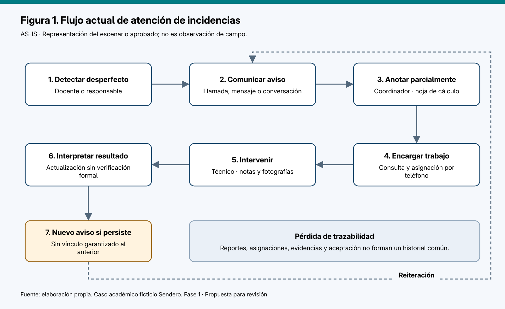
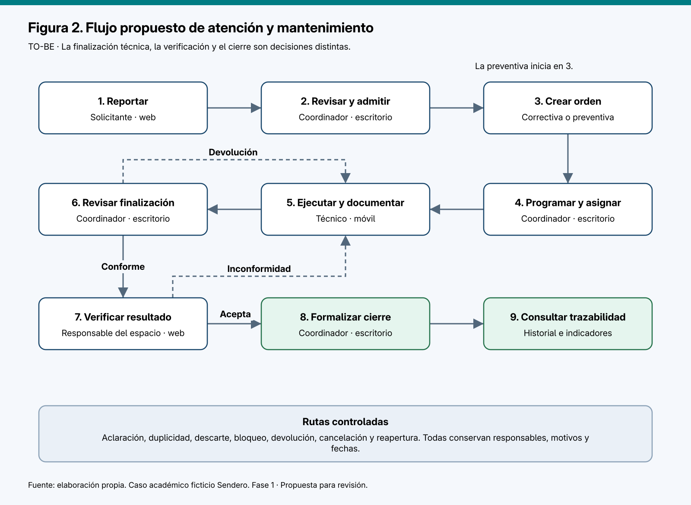
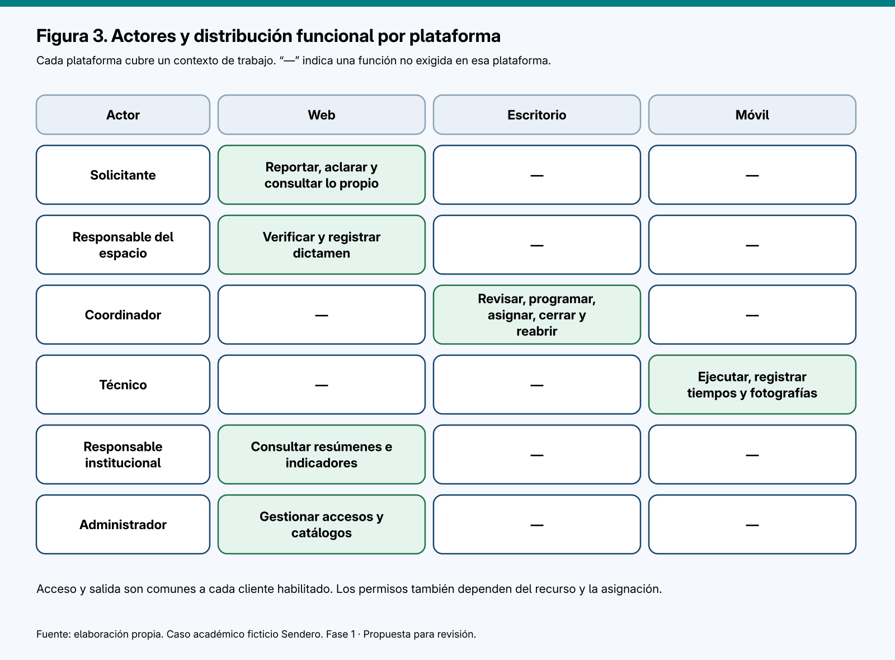
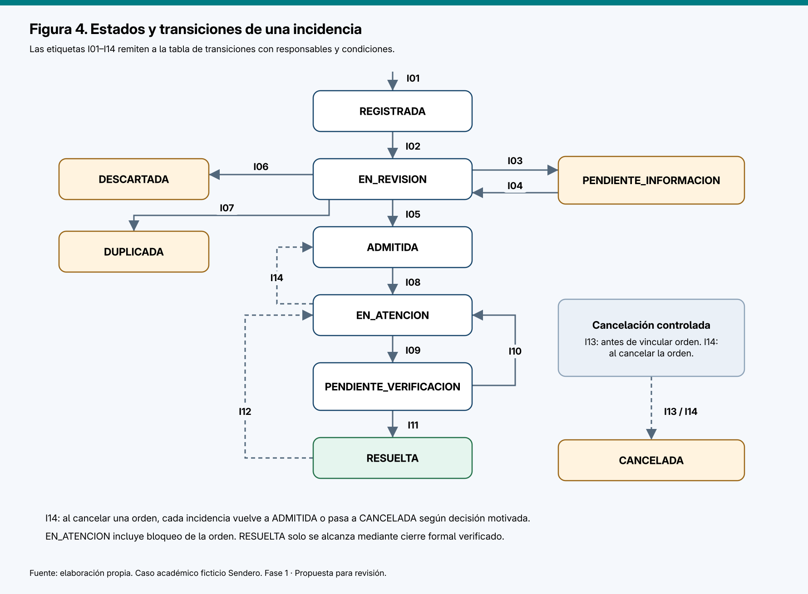
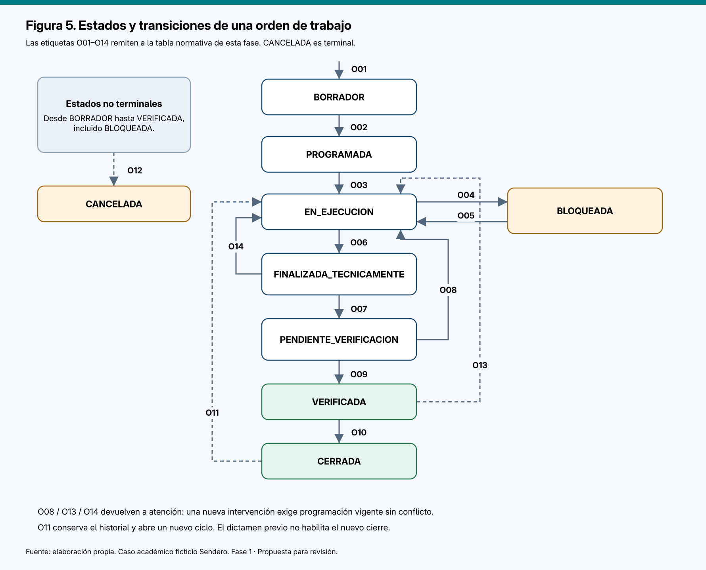
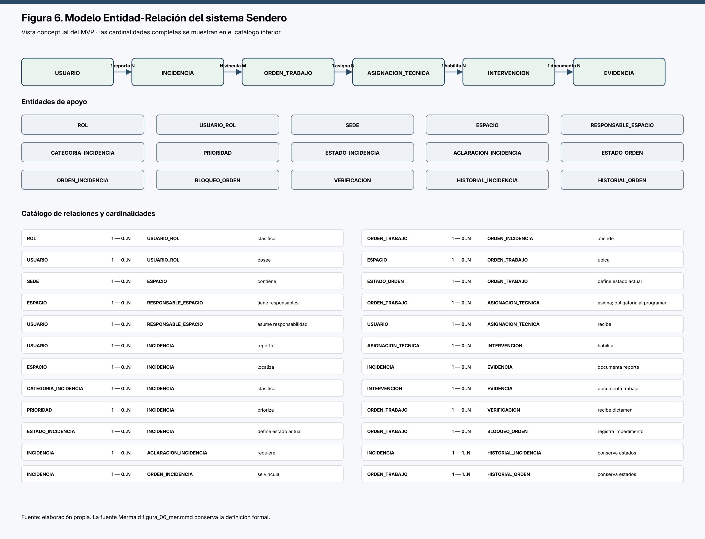
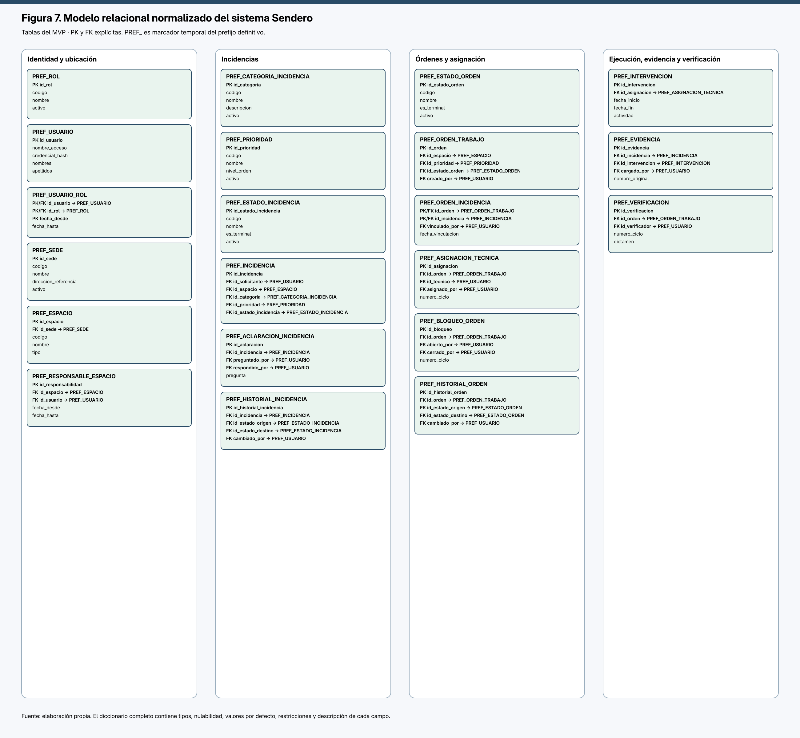
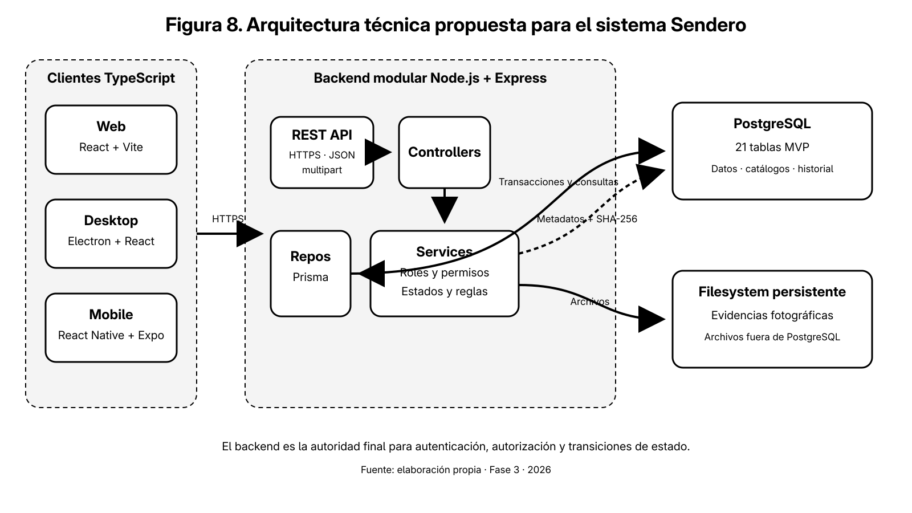

# Sistema multiplataforma para la gestión de incidencias y mantenimiento de infraestructura educativa

## Informe académico consolidado de análisis, modelado de datos y arquitectura

**Autor:** Stalyn Mateo Sánchez Cevallos  
**Institución:** Instituto Superior Universitario Japón  
**Carrera:** Tecnología Superior en Desarrollo de Software  
**Año:** 2026  
**Caso de estudio:** Centro de Formación Técnica Sendero, institución ficticia  
**Repositorio público:** https://github.com/snxz-dev/sendero-mantenimiento-educativo

## Declaración de estado del proyecto

Este informe consolida las Fases 1, 2 y 3. El análisis y diseño están completados; la base de datos está diseñada con 21 tablas MVP normalizadas hasta 3FN; y la arquitectura y el stack están definidos. La implementación de Web, Desktop, Mobile y Backend permanece pendiente. No existen todavía código funcional de las aplicaciones, despliegues ni pruebas de software ejecutadas.

## Resumen

El caso aborda la falta de trazabilidad en la atención de incidencias de infraestructura educativa. La información dispersa entre mensajes, llamadas, hojas de cálculo y fotografías impide conocer con certeza qué fue reportado, quién debe intervenir, qué evidencia existe y si el resultado fue verificado antes del cierre. Se diseña un sistema que integra el flujo reporte, revisión y priorización, orden de trabajo, asignación, intervención, evidencia, finalización técnica, verificación, cierre o reapertura e historial.

La solución distribuye funciones entre tres clientes. Web atiende a solicitantes, responsables de espacios y consulta institucional; Desktop concentra coordinación y administración; Mobile acompaña el trabajo técnico de campo. Los tres consumen una API REST compartida. El backend Node.js, Express y TypeScript centralizará permisos y reglas; Prisma accederá a PostgreSQL; y las fotografías se conservarán en un filesystem persistente administrado por el backend, con metadatos y hash en la base.

El alcance del MVP queda congelado en 21 tablas. Las estructuras de duplicidad, cancelación formal, corrección auditada y versiones avanzadas de programación siguen documentadas como ampliaciones y no se presentan como funciones disponibles. Los resultados expuestos son de análisis y diseño; el informe no atribuye mejoras medibles antes de implementar y probar el sistema.

**Palabras clave:** incidencias, mantenimiento educativo, trazabilidad, arquitectura cliente-servidor, PostgreSQL, TypeScript.

## Abstract

This academic report specifies a multiplatform information system for tracking maintenance incidents in an educational institution. The proposed process links each report to review, prioritization, work orders, technician assignments, interventions, photographic evidence, independent verification, closure or reopening, and immutable history. Web, desktop, and mobile clients will consume one REST API so that authorization and state transitions remain centralized.

The MVP data model contains 21 relational tables normalized to Third Normal Form. PostgreSQL is selected as the database engine, Prisma as the data access layer, and a backend-managed persistent filesystem as the initial photographic storage. Analysis, data design, and architecture are complete. Application implementation and software testing remain pending.

**Keywords:** incident management, educational maintenance, traceability, REST API, PostgreSQL, TypeScript.

## Índice general

1. Introducción y marco del caso  
2. Análisis y diseño funcional  
3. Modelado y diseño de base de datos  
4. Arquitectura y stack tecnológico  
5. Conclusiones  
6. Recomendaciones  
7. Referencias y anexos

## 1. Introducción y marco del caso

### 1.1. Tema y contextualización

El proyecto diseña un sistema para la gestión de incidencias y mantenimiento de infraestructura educativa. Sendero representa una institución ficticia con sedes, aulas, laboratorios y áreas comunes. El caso permite estudiar un problema distinto de ventas, facturación e inventario y justifica tres plataformas por sus contextos de uso: acceso general mediante web, coordinación intensiva mediante escritorio y ejecución en campo mediante móvil.

### 1.2. Problema y objetivo general

La institución carece de un registro único que conecte reporte, decisión, trabajo técnico, evidencia y verificación. El objetivo es desarrollar posteriormente un sistema integrado que conserve esa trazabilidad y produzca información reproducible sobre atención y reaperturas. En las fases consolidadas se especifica la solución; todavía no se demuestra su efecto operativo.

### 1.3. Método de desarrollo documental

El trabajo utiliza una metodología incremental por fases. Cada fase establece una línea base antes de avanzar: Fase 1 formaliza el dominio y el MVP; Fase 2 transforma esos requerimientos en un modelo de datos; Fase 3 decide arquitectura, tecnologías, seguridad y adaptación física a PostgreSQL. Las decisiones conservan trazabilidad con los requerimientos y separan el MVP de las ampliaciones.

### 1.4. Alcance consolidado

El MVP cubre el flujo completo de mantenimiento correctivo, desde el reporte hasta el historial. Quedan fuera inventarios, compras, facturación, pagos, geolocalización continua, funcionamiento offline, mensajería externa y automatización avanzada. Tampoco se habilitan las cuatro estructuras futuras diseñadas en Fase 2.

# Parte II. Análisis y diseño funcional

## 2.1. Resumen ejecutivo y decisiones de alcance

El problema central es la falta de trazabilidad en la atención del mantenimiento de espacios educativos. Los avisos, las asignaciones y las evidencias se encuentran dispersos; por ello resulta difícil establecer qué está pendiente, quién debe actuar y si la intervención resolvió el problema.

Se propone un proceso que relaciona el reporte con una orden de trabajo, registra intervenciones y exige una verificación antes del cierre. La web concentrará solicitudes, verificación y consulta institucional; escritorio concentrará coordinación; móvil concentrará ejecución en campo. Compartir datos y reglas es una necesidad del sistema, no una selección de arquitectura en esta fase.

Se mantienen separados INCIDENCIA, ORDEN_TRABAJO, INTERVENCION, VERIFICACION e HISTORIAL_ESTADO. Una fotografía será evidencia de un reporte o una intervención; no sustituirá una verificación favorable.

Los entregables de esta fase son: análisis, factibilidad preliminar, requerimientos, reglas, metodología propuesta, matriz de actores y plataformas, ciclos de vida, criterios de aceptación, trazabilidad y cinco figuras reales con fuentes estructuradas. UML de casos de uso y clases, MER, arquitectura y mockups corresponden a fases posteriores.

## 2.2. Origen y confiabilidad de la información

| Clasificación | Contenido | Tratamiento |
|---|---|---|
| Confirmado por el usuario | Caso ficticio Sendero, dos sedes y dominio de mantenimiento educativo; tres plataformas; productos académicos; revisión por fases. | Base del trabajo. “Confirmado” significa aceptado para el caso, no observado en una institución. |
| Confirmado por el usuario | Separación conceptual, estados explícitos, matriz funcional, figuras estructuradas y exclusiones de alcance. | Condiciones obligatorias. |
| Escenario aprobado | Avisos por mensajes y llamadas, hoja de cálculo de coordinación, notas técnicas y fotografías dispersas. | Base para representar el proceso AS-IS. |
| Inferencia de análisis | Centralizar el historial puede reducir consultas repetidas y facilitar continuidad. | Hipótesis; no resultado demostrado. |
| Propuesta de esta fase | Estados, transiciones, permisos, reglas refinadas, requerimientos y metodología. | Se convierten en línea base solo después de la revisión. |
| Sin evidencia disponible | Frecuencia de fallas, tiempos actuales, presupuesto, infraestructura informática, disponibilidad del equipo, número de usuarios. | No cuantificar ni presentar mejoras como medidas. |

No se ha consultado ni reutilizado ningún proyecto anterior. Este documento es una especificación original del caso aprobado; no incorpora una encuesta, entrevista o rúbrica institucional que no exista.

## 2.3. Problema, causas, efectos y justificación

### 2.3.1. Problema central

La institución no dispone de un registro único y trazable que permita coordinar y verificar el mantenimiento desde el reporte hasta la aceptación del trabajo.

### 2.3.2. Relaciones causales del escenario

| Causa | Manifestación | Efecto planteado |
|---|---|---|
| Canales de recepción separados | Avisos sobre la misma falla no vinculados. | Duplicidad y necesidad de aclaraciones manuales. |
| Priorización informal | No queda registrada la razón del orden de atención. | Dificultad para justificar decisiones. |
| Agenda no consolidada | Asignaciones por teléfono sin control común. | Conflictos potenciales de horarios y responsabilidad. |
| Notas y fotografías dispersas | El siguiente técnico no dispone de todos los antecedentes. | Pérdida de continuidad. |
| Falta de aceptación formal | “Trabajo terminado” se interpreta como “problema resuelto”. | Cierres prematuros y seguimiento incompleto. |
| Fechas incompletas | No existe una secuencia confiable de eventos. | Indicadores de atención no reproducibles. |

### 2.3.3. Impacto y necesidad

Las fallas pueden limitar temporalmente el uso de espacios y demandar tiempo de coordinación. Su magnitud no está medida. El sistema se justifica por la necesidad de identificar responsabilidades, consolidar evidencias, conservar decisiones y comprobar la resolución. No se promete eliminar fallas físicas ni demostrar ahorros sin datos.

El software apoyará decisiones de mantenimiento; no diagnosticará automáticamente riesgos técnicos ni sustituirá los procedimientos de emergencia.

## 2.4. Objetivos y alcance

### 2.4.1. Objetivo general

Desarrollar y verificar un sistema integrado de escritorio, web y móvil para gestionar incidencias y órdenes de mantenimiento en Sendero, conservando trazabilidad desde el reporte hasta la verificación y proporcionando información medible de atención, programación y reaperturas.

### 2.4.2. Objetivos específicos

- OE-01: formalizar el proceso, responsabilidades, estados y reglas de atención.
- OE-02: modelar la información y sus restricciones sin duplicar hechos de negocio.
- OE-03: distribuir funciones según el contexto de uso de cada plataforma.
- OE-04: implementar posteriormente un flujo integrado con control de acceso y validaciones.
- OE-05: verificar los flujos y calcular indicadores reproducibles con evidencia.
- OE-06: documentar la solución, sus límites y las condiciones de operación.

### 2.4.3. Incluido

Reportes, aclaraciones, clasificación, duplicados, órdenes correctivas y preventivas manuales, técnicos responsables y colaboradores, programación, intervenciones, bloqueos, evidencias fotográficas, verificación, cierre, reapertura, cancelación, historial, consulta e indicadores. Administración mínima de usuarios, roles, sedes, espacios, responsables y categorías.

### 2.4.4. Excluido

Inventarios, compras, facturación, pagos, contratos, nómina, geolocalización continua, sensores, mantenimiento predictivo, integraciones académicas, funcionamiento offline y programación preventiva recurrente automática. No se crea un catálogo de activos o repuestos como sustituto encubierto de un inventario.

No se incluyen mensajería externa, notificaciones push o correos automáticos. La primera versión utilizará bandejas de pendientes y estados visibles dentro de las aplicaciones. Esas integraciones requerirían una ampliación explícita.

### 2.4.5. Restricciones

Las escrituras requieren conexión. Las operaciones fallidas no pueden mostrarse como confirmadas. Los datos de demostración serán ficticios. Las iniciales SQL deben ser proporcionadas por el usuario. El stack y la propuesta visual requieren revisión en sus fases. Se mantendrán revisiones al finalizar cada fase.

**Entorno de desarrollo confirmado por el usuario:** Arch Linux dentro de WSL. La creación del aplicativo, instalación de dependencias de desarrollo, ejecución y pruebas se realizarán en esa distribución; no se creará un entorno de desarrollo de la aplicación en Windows. El formato de distribución y el sistema destino de escritorio/móvil se decidirán después: desarrollar en WSL no define por sí mismo los dispositivos de destino. Los documentos de esta fase se entregan en la carpeta compartida de resultados.

La confirmación procede expresamente de la instrucción del usuario: “utiliza el WSL de Arch Linux que tengo para hacer el aplicativo”. Por tanto, no es una inferencia del análisis ni una decisión tecnológica tomada por el proyecto. La distribución disponible se identificó como `archlinux`; esto confirma el entorno de trabajo, pero no selecciona lenguajes, frameworks ni plataformas de destino.

La selección del soporte de escritorio, navegadores, dispositivos y versiones móviles se realizará después de conocer el entorno. No se asume que las tres plataformas funcionarán en cualquier dispositivo.

## 2.5. Procesos actual y propuesto

### 2.5.1. AS-IS — proceso actual del escenario

Un docente o responsable detecta el problema y lo comunica por un canal informal. El coordinador transcribe lo que recibe, consulta disponibilidad y encarga el trabajo. El técnico visita el espacio y comparte notas o fotografías. La coordinación interpreta el resultado y actualiza su registro cuando recibe información suficiente. Ante recurrencia o inconformidad, se produce otro aviso sin relación garantizada con el anterior.

Esta descripción procede del escenario ficticio aprobado; no es un levantamiento de campo. Los puntos de pérdida de trazabilidad son hipótesis de diseño del caso.

**Figura 1. Flujo actual de atención de incidencias.** Fuente: elaboración propia a partir del escenario académico. Las discontinuidades representan ausencia de un registro común.

### 2.5.2. TO-BE — proceso propuesto

Recepción identificada → revisión → admisión → orden → programación → ejecución → revisión técnica → verificación del espacio → cierre. Aclaración, duplicidad, descarte, bloqueo e inconformidad son rutas controladas, no borrados de información.

Una orden preventiva comienza en planificación sin reporte previo. Se somete a las mismas reglas de ejecución, verificación y cierre que una correctiva.

**Figura 2. Flujo propuesto de atención y mantenimiento.** Fuente: elaboración propia. Las rutas excepcionales se detallan en las tablas de estados.

### 2.5.3. Entradas y salidas

| Proceso | Entrada mínima | Salida verificable | Responsable |
|---|---|---|---|
| Reportar | Espacio, categoría y descripción. | Incidencia identificada con autor y fecha. | Solicitante |
| Revisar | Reporte y aclaraciones. | Decisión motivada y prioridad si se admite. | Coordinador |
| Planificar | Incidencia admitida o actividad preventiva. | Orden con alcance, espacio y programación. | Coordinador |
| Asignar | Disponibilidad y funciones técnicas. | Responsable y participantes sin solapamiento. | Coordinador |
| Ejecutar | Orden programada y acceso al espacio. | Intervenciones, resultados y tiempos. | Técnicos asignados |
| Revisar el trabajo | Finalización técnica y evidencias. | Devolución o solicitud de verificación. | Coordinador |
| Verificar | Trabajo presentado y espacio intervenido. | Dictamen favorable o inconformidad. | Responsable del espacio |
| Cerrar | Verificación favorable vigente. | Cierre formal e incidencias resueltas. | Coordinador |
| Evaluar | Historial y fechas consistentes. | Indicadores con población y filtros explícitos. | Coordinador / responsable institucional |

## 2.6. Actores, permisos y plataformas

### 2.6.1. Actores

Solicitante: informa y consulta sus incidencias. Responsable del espacio: verifica trabajos de los espacios bajo su responsabilidad. Coordinador: gestiona el proceso y sus excepciones. Técnico: ejecuta trabajos asignados. Responsable institucional: consulta información consolidada. Administrador: mantiene accesos y catálogos; no obtiene por ese solo rol permiso para cerrar órdenes o verificar trabajos.

Una persona puede tener varios roles autorizados. El acceso depende del rol y del recurso: ser técnico no permite editar cualquier orden; ser responsable de un espacio no permite verificar otro. No habrá autorregistro público en el alcance inicial.

### 2.6.2. Matriz Actor × Plataforma × Funcionalidad

“—” significa que no se exige esa función en esa plataforma. No supone prohibición futura, pero evita triplicar las interfaces.

| Actor | Web | Escritorio | Móvil |
|---|---|---|---|
| Solicitante | Reportar, adjuntar fotos, aclarar, consultar lo propio y solicitar cancelación. | — | — |
| Responsable del espacio | Ver órdenes por verificar, revisar evidencias y emitir dictamen. También reportar si tiene rol de solicitante. | — | — |
| Coordinador | — | Revisar reportes; clasificar; gestionar duplicados; crear y programar órdenes; asignar; gestionar bloqueos y devoluciones; cerrar, cancelar y reabrir; consultar indicadores. | — |
| Técnico | — | — | Ver sus asignaciones e historial necesario; registrar intervenciones y fotografías. El responsable técnico puede iniciar, bloquear, reanudar y finalizar la orden. |
| Responsable institucional | Consultar indicadores y resúmenes autorizados. | — | — |
| Administrador | Gestionar usuarios, roles, sedes, espacios, responsables y categorías. | — | — |
| Todos los roles habilitados | Acceso y salida cuando tengan funciones web. | Acceso y salida del coordinador. | Acceso y salida del técnico. |

La web podrá adaptarse a distintos tamaños de pantalla; ello no reemplaza el entregable de cliente móvil para técnicos. Las funciones compartidas son acceso, validación, consulta contextual e historial pertinente; no se replica toda la administración.

**Figura 3. Actores y distribución funcional por plataforma.** Fuente: elaboración propia. “Técnico responsable” y “colaborador” son responsabilidades dentro de una asignación.

## 2.7. Ciclo de vida de las incidencias

### 2.7.1. Estados permitidos

| Estado | Significado |
|---|---|
| REGISTRADA | Reporte recibido y pendiente de evaluación. |
| EN_REVISION | El coordinador está evaluando admisibilidad, claridad y duplicidad. |
| PENDIENTE_INFORMACION | Se solicitó aclaración concreta al autor. |
| ADMITIDA | Reporte aceptado y priorizado; todavía no tiene una orden activa vinculada. |
| EN_ATENCION | Tiene orden activa vinculada fuera de la etapa de verificación favorable o pendiente. Incluye planificación, ejecución y bloqueos. |
| PENDIENTE_VERIFICACION | La orden fue enviada a verificación o ya está verificada pero aún no se cierra. La interfaz distingue ambas situaciones mediante el estado de la orden. |
| RESUELTA | La orden vinculada fue cerrada tras verificación favorable. |
| DESCARTADA | El reporte no procede y conserva una razón explícita. |
| DUPLICADA | El reporte apunta a una incidencia principal del mismo problema. |
| CANCELADA | Se retiró o dejó sin efecto mediante decisión del coordinador y motivo registrado. |

### 2.7.2. Transiciones válidas

| ID | Origen → destino | Responsable del evento | Condiciones y resultado |
|---|---|---|---|
| I01 | Sin registro → REGISTRADA | Solicitante | Datos obligatorios válidos y espacio activo. Se conserva autor y fecha. |
| I02 | REGISTRADA → EN_REVISION | Coordinador | Inicia evaluación. |
| I03 | EN_REVISION → PENDIENTE_INFORMACION | Coordinador | Registra una pregunta o dato faltante específico. |
| I04 | PENDIENTE_INFORMACION → EN_REVISION | Solicitante autor | Aporta respuesta; no puede admitir su reporte. |
| I05 | EN_REVISION → ADMITIDA | Coordinador | Confirma pertinencia, categoría, prioridad y motivo. |
| I06 | EN_REVISION → DESCARTADA | Coordinador | Motivo de no procedencia obligatorio. |
| I07 | EN_REVISION → DUPLICADA | Coordinador | Referencia una incidencia principal admitida o en atención del mismo problema y espacio; no puede apuntar a sí misma ni a otro duplicado. |
| I08 | ADMITIDA → EN_ATENCION | Coordinador, al vincular orden | Orden correctiva no terminal y mismo espacio; ausencia de otra orden activa para esa incidencia. |
| I09 | EN_ATENCION → PENDIENTE_VERIFICACION | Sistema, por O07 | La orden vinculada se envía a verificación. |
| I10 | PENDIENTE_VERIFICACION → EN_ATENCION | Sistema, por O08 u O13 | Inconformidad o retiro justificado de una verificación ya favorable. |
| I11 | PENDIENTE_VERIFICACION → RESUELTA | Sistema, por O10 | Cierre formal de la orden con verificación favorable vigente. |
| I12 | RESUELTA → EN_ATENCION | Sistema, por O11 | Reapertura autorizada de la orden del mismo problema; afecta a sus incidencias principales vinculadas. |
| I13 | REGISTRADA, EN_REVISION, PENDIENTE_INFORMACION o ADMITIDA → CANCELADA | Coordinador | Motivo y solicitud o causa identificada; no tiene orden activa. |
| I14 | EN_ATENCION o PENDIENTE_VERIFICACION → ADMITIDA o CANCELADA | Sistema, por O12 | Al cancelar la orden, el coordinador debe decidir para cada incidencia si continúa pendiente de otra atención o si se cancela con motivo. |

No hay otras transiciones autorizadas. DESCARTADA, DUPLICADA y CANCELADA son terminales en la primera versión: un nuevo hecho se registra como nuevo reporte con referencia al anterior. Una incidencia no se marca RESUELTA manualmente. En DUPLICADA se muestra el avance de la principal sin cambiar el estado del duplicado ni sumar ambos al mismo indicador de resolución.

Una incidencia vinculada a una orden BLOQUEADA continúa EN_ATENCION y muestra el bloqueo de la orden. Así se evita multiplicar estados equivalentes entre ambos objetos.

**Figura 4. Estados y transiciones de una incidencia.** Fuente: elaboración propia. Los identificadores remiten a la tabla I01–I14; el panel inferior muestra cancelaciones agrupadas.

## 2.8. Ciclo de vida de las órdenes de trabajo

### 2.8.1. Estados permitidos

| Estado | Significado |
|---|---|
| BORRADOR | Orden creada, aún sin programación completa. |
| PROGRAMADA | Alcance, intervalo previsto, responsable y participantes definidos. |
| EN_EJECUCION | El técnico responsable inició o retomó el trabajo. |
| BLOQUEADA | Existe impedimento documentado que detiene el trabajo. |
| FINALIZADA_TECNICAMENTE | El técnico declara terminado el trabajo; falta revisión del coordinador. |
| PENDIENTE_VERIFICACION | El coordinador solicita dictamen del responsable del espacio. |
| VERIFICADA | Existe dictamen favorable vigente; falta cierre formal. |
| CERRADA | El coordinador formalizó el cierre. |
| CANCELADA | La orden dejó de ejecutarse por decisión motivada. |

### 2.8.2. Transiciones válidas

| ID | Origen → destino | Responsable | Condiciones y resultado |
|---|---|---|---|
| O01 | Sin orden → BORRADOR | Coordinador | Correctiva: al menos una incidencia admitida del mismo espacio. Preventiva: actividad y espacio definidos, sin incidencia obligatoria. |
| O02 | BORRADOR → PROGRAMADA | Coordinador | Intervalo válido, fecha prevista de término, un técnico responsable activo, colaboradores y responsable de verificación disponibles. No hay solapamientos. |
| O03 | PROGRAMADA → EN_EJECUCION | Técnico responsable | Confirma inicio real; asignación vigente e intervalo vigente o reprogramado que cubra ese inicio. |
| O04 | EN_EJECUCION → BLOQUEADA | Técnico responsable o coordinador | Registra motivo, descripción y próxima acción o condición necesaria. No se inventa una fecha de resolución. |
| O05 | BLOQUEADA → EN_EJECUCION | Técnico responsable | Impedimento atendido y autorización del coordinador registrada; programación vigente sin conflicto. |
| O06 | EN_EJECUCION → FINALIZADA_TECNICAMENTE | Técnico responsable | Al menos una intervención cerrada; ninguna intervención abierta; resultado, tiempos y evidencia visual o justificación de ausencia. |
| O07 | FINALIZADA_TECNICAMENTE → PENDIENTE_VERIFICACION | Coordinador | Revisa integridad del registro y designación vigente del verificador; no equivale a certificar técnicamente la reparación. |
| O08 | PENDIENTE_VERIFICACION → EN_EJECUCION | Responsable del espacio | Dictamen no conforme con motivo. Registra la devolución; un nuevo trabajo solo comienza con programación vigente y sin conflicto. |
| O09 | PENDIENTE_VERIFICACION → VERIFICADA | Responsable del espacio | Dictamen favorable, autor, fecha y observación. No participó como técnico en esa orden. |
| O10 | VERIFICADA → CERRADA | Coordinador | Verificación favorable vigente, sin nuevas intervenciones o incidencias añadidas después del dictamen y sin datos obligatorios faltantes. |
| O11 | CERRADA → EN_EJECUCION | Coordinador | Mismo defecto o trabajo, motivo de reapertura, técnico responsable y nueva programación sin conflicto; invalida la vigencia del dictamen anterior sin borrarlo. |
| O12 | Cualquier estado no terminal → CANCELADA | Coordinador | Motivo obligatorio; cerrar intervenciones abiertas con resultado interrumpido; decidir destino de cada incidencia vinculada. No se cancela una orden ya cerrada. |
| O13 | VERIFICADA → EN_EJECUCION | Coordinador | Se detecta problema antes del cierre; motivo registrado e invalidación de la vigencia del dictamen. Reprogramar antes de iniciar intervención. |
| O14 | FINALIZADA_TECNICAMENTE → EN_EJECUCION | Coordinador | Registro incompleto o trabajo pendiente: devuelve con motivo. Reprogramar si hace falta antes de iniciar nueva intervención. |

No se admite el cierre directo desde EN_EJECUCION o FINALIZADA_TECNICAMENTE. CANCELADA es terminal. Una falla distinta o una actividad preventiva posterior requiere nueva orden; no reapertura de una antigua para ocultar un nuevo trabajo.

Cambiar fecha o técnico en BORRADOR, PROGRAMADA, EN_EJECUCION o BLOQUEADA es una operación auditada, no un nuevo estado. Si hay una intervención abierta del técnico afectado, debe cerrarse antes de reasignarlo. Las devoluciones pueden dejar trabajo pendiente de reprogramación: no habilitan una nueva intervención por sí solas.

Al bloquear una orden se liberan los intervalos futuros no ejecutados de sus asignaciones, conservando su versión histórica. Reanudar exige nuevos intervalos o ratificar los vigentes sin conflicto. Las asignaciones se comparan como intervalos [inicio, fin): terminar a la hora en que comienza otra no se considera solapamiento. El control se aplica al responsable y a cada colaborador.

**Figura 5. Estados y transiciones de una orden de trabajo.** Fuente: elaboración propia. Los identificadores remiten a O01–O14; cancelaciones se agrupan para mantener legibilidad.

### 2.8.3. Coherencia entre objetos y concurrencia

- La vinculación, los cambios de estado y su historial deben confirmarse como una sola operación de negocio: no se admite actualizar la orden y dejar las incidencias en un estado incompatible.
- Una incidencia tiene como máximo una orden correctiva activa. Una orden correctiva atiende una o varias incidencias principales del mismo problema y espacio. Las relaciones definitivas se resolverán en el modelado.
- Una orden preventiva atiende un espacio y no resuelve incidencias por asociación implícita. Un defecto descubierto en ella puede originar un nuevo reporte y orden correctiva relacionados como antecedente.
- En BORRADOR, PROGRAMADA, EN_EJECUCION o BLOQUEADA se pueden agregar incidencias admitidas del mismo problema; no después de la finalización técnica.
- Una decisión sobre una versión desactualizada debe rechazarse e indicar recarga. Esto incluye dos coordinadores asignando simultáneamente el mismo técnico o una verificación concurrente con cancelación.
- HISTORIAL_ESTADO conserva transiciones. Las reasignaciones, reprogramaciones y correcciones de datos también requieren auditoría, aunque no cambien el estado. Su estructura se decidirá después.

## 2.9. Reglas de negocio consolidadas

Las reglas RN-01–RN-16 de la ficha aprobada se conservan y se precisan mediante los ciclos anteriores. Las siguientes extensiones son propuestas explícitas de esta fase, no información atribuida a una institución real.

| Código | Regla o precisión |
|---|---|
| RN-01 | Toda incidencia identifica solicitante, espacio, categoría, descripción y fecha de registro. |
| RN-02 | El solicitante puede indicar urgencia; el coordinador confirma la prioridad operativa y su justificación. |
| RN-03 | Las prioridades son baja, media, alta y crítica, según los criterios propuestos en 9.1. No implican compromisos de tiempo todavía. |
| RN-04 | Un duplicado se vincula a una incidencia principal y se conserva en el historial. |
| RN-05 | Cada incidencia admite como máximo una orden correctiva activa; una orden puede atender varios reportes del mismo problema y espacio. |
| RN-06 | La orden preventiva identifica espacio, actividad y programación; no requiere reporte previo. Puede nacer como borrador antes de completar su programación. |
| RN-07 | Toda orden programada tiene exactamente un técnico responsable y puede incluir colaboradores. |
| RN-08 | Ningún técnico puede tener intervalos programados que se superpongan. |
| RN-09 | Solo los técnicos asignados registran intervenciones. El coordinador administra asignaciones y revisa los resultados. |
| RN-10 | Bloquear requiere motivo; reanudar requiere registrar la solución del impedimento y la autorización correspondiente. |
| RN-11 | La finalización técnica requiere intervención, tiempos, resultado y fotografía o justificación de su ausencia. |
| RN-12 | Finalizar técnicamente no cierra la orden: el responsable del espacio verifica y el coordinador formaliza el cierre. |
| RN-13 | La inconformidad devuelve a atención. La reapertura posterior al cierre requiere motivo y autorización del coordinador. |
| RN-14 | Cancelaciones, descartes y duplicados conservan motivo, autor e historial. |
| RN-15 | Cada cambio de estado conserva autor, fecha, estado anterior y nuevo. Las correcciones retrospectivas deben identificarse. |
| RN-16 | Usuarios y espacios con historial se inhabilitan cuando corresponda; no se eliminan destruyendo sus referencias. |
| RN-17 | El cierre exige verificación favorable vigente; quien intervino como técnico no puede verificar esa misma orden, aunque tenga ambos roles. |
| RN-18 | No hay cierre automático por silencio del verificador. El coordinador puede designar otro responsable autorizado del espacio, dejando motivo. |
| RN-19 | Los cambios de estado solo se realizan por las transiciones I01–I14 y O01–O14 y conservan actor, fecha, origen, destino y motivo cuando aplique. |
| RN-20 | La cancelación conserva registros; si la necesidad persiste, devuelve la incidencia a ADMITIDA. Cancelar la orden no demuestra resolución. |
| RN-21 | La reapertura mantiene las intervenciones y verificaciones anteriores, identifica un nuevo ciclo y exige otra verificación antes del cierre. |
| RN-22 | El responsable técnico controla los estados de ejecución; los colaboradores registran intervenciones propias y comunican impedimentos. |
| RN-23 | Cada intervención identifica técnico, orden, actividad, inicio, fin y resultado. Fin no puede ser anterior a inicio. Un técnico no registra intervalos de intervención superpuestos. |
| RN-24 | Los registros finalizados no se sobrescriben silenciosamente. Una corrección requiere autorización del coordinador, motivo y conservación del valor anterior. |
| RN-25 | La información de un duplicado no se elimina. Su vínculo principal no puede formar ciclos ni cadenas de duplicados. |
| RN-26 | Los intervalos programados de una persona no se superponen; los históricos ejecutados se conservan al reprogramar. |
| RN-27 | El solicitante consulta lo propio; el técnico, sus asignaciones; el verificador, sus espacios; la consulta institucional es consolidada; los catálogos se administran con permiso específico. |

### 2.9.1. Criterios iniciales de prioridad

| Nivel | Criterio de clasificación propuesto |
|---|---|
| Crítica | Riesgo aparente para personas o necesidad de restringir inmediatamente el uso del espacio. Activar el procedimiento institucional de emergencia fuera del sistema. |
| Alta | Espacio sin posibilidad de uso para su actividad prevista y sin alternativa disponible. |
| Media | Afectación parcial con alternativa temporal o uso limitado. |
| Baja | Deterioro que permite continuar la actividad sin la afectación anterior. |

El coordinador valida la prioridad y registra la razón; las aplicaciones no diagnostican peligros. No se fijan tiempos máximos por prioridad sin capacidad y políticas de atención. Las definiciones deberán revisarse con quien represente la operación institucional.

## 2.10. Requerimientos funcionales y aceptación

Los criterios siguientes son verificables en pruebas futuras; no son resultados de pruebas ejecutadas.

| ID | El sistema debe permitir… | Criterio de aceptación principal |
|---|---|---|
| RF-01 | Identificar al usuario, iniciar y cerrar su sesión y aplicar permisos. | Un usuario sin rol o alcance sobre el recurso no puede ejecutar la acción, incluso si intenta omitir la interfaz. |
| RF-02 | Administrar usuarios y roles e inhabilitar accesos. | Inhabilitar impide nuevas acciones protegidas y preserva registros históricos. |
| RF-03 | Administrar sedes, espacios, responsables y categorías. | No se seleccionan registros inactivos para nuevas operaciones; los históricos siguen visibles. |
| RF-04 | Registrar incidencias con evidencia opcional. | Rechaza ausencia de espacio, categoría o descripción; genera identificador, autor y fecha tras guardado confirmado. |
| RF-05 | Consultar el estado y el historial de las incidencias propias. | Un solicitante no obtiene reportes ajenos cambiando su identificador. |
| RF-06 | Solicitar y responder aclaraciones. | I03 e I04 conservan pregunta, respuesta y autor. |
| RF-07 | Admitir, priorizar o descartar reportes. | Solo el coordinador ejecuta I05 o I06; prioridad y razón quedan registradas. |
| RF-08 | Marcar duplicados y mostrar su incidencia principal. | Rechaza autorreferencia, principal duplicada o de otro problema/espacio. |
| RF-09 | Registrar una solicitud de cancelación y resolverla. | El solicitante no cancela directamente; el coordinador aplica I13 u O12 según exista orden. |
| RF-10 | Crear órdenes correctivas y vincular incidencias admitidas. | Impide segunda orden activa para una incidencia y conserva vínculos de órdenes anteriores canceladas o cerradas. |
| RF-11 | Crear órdenes preventivas manuales. | Exige espacio y actividad; no exige incidencia ficticia para poder guardarlas. |
| RF-12 | Programar, asignar y reasignar técnicos. | Exige responsable y fechas válidas, rechaza solapamientos para todos los participantes y audita cambios. |
| RF-13 | Consultar asignaciones desde móvil. | El técnico ve órdenes propias y datos necesarios del espacio y antecedentes. |
| RF-14 | Iniciar, bloquear y reanudar órdenes. | Cumple O03–O05, permisos, motivos y condiciones de programación. |
| RF-15 | Registrar intervenciones y sus tiempos. | Cada técnico edita solo intervenciones propias abiertas; se rechazan tiempos inválidos y solapados. |
| RF-16 | Adjuntar y consultar evidencias autorizadas. | La evidencia queda ligada a su reporte o intervención; un archivo fallido no aparece como disponible. |
| RF-17 | Declarar finalización técnica. | O06 rechaza orden sin intervención cerrada o con alguna abierta, y exige evidencia o justificación. |
| RF-18 | Revisar la finalización y enviarla a verificación o devolverla. | El coordinador aplica O07 u O14 con condiciones y motivo pertinentes. |
| RF-19 | Registrar dictamen del responsable del espacio. | O08/O09 rechazan a quien no es responsable autorizado o participó como técnico. |
| RF-20 | Formalizar el cierre. | O10 exige dictamen favorable vigente y actualiza las incidencias vinculadas a RESUELTA. |
| RF-21 | Reabrir una orden cerrada. | O11 exige motivo, asignación y programación; conserva el cierre anterior y requiere nueva verificación. |
| RF-22 | Cancelar órdenes y resolver el destino de sus incidencias. | O12 exige motivos y una decisión por incidencia; ninguna queda EN_ATENCION con solo una orden cancelada. |
| RF-23 | Consultar historiales y decisiones auditadas. | Se identifica quién cambió qué y cuándo; un usuario ordinario no puede reescribir el historial. |
| RF-24 | Filtrar bandejas por estado, sede, espacio, prioridad y fechas pertinentes. | Los filtros respetan permisos y muestran claramente resultados vacíos. |
| RF-25 | Calcular y consultar indicadores definidos. | Los resultados exponen período, denominador y exclusiones; denominador cero produce “no calculable”. |
| RF-26 | Registrar correcciones autorizadas sin destruir el dato previo. | Muestra valor anterior, nuevo, autor, autorización y motivo. |
| RF-27 | Informar guardado, error y conflicto de versión. | Una respuesta fallida o incierta no se presenta como éxito; un reintento no duplica el registro. |

### 2.10.1. Clasificación de requerimientos funcionales

La clasificación no elimina ni renumera requerimientos. Define qué deberá implementarse para demostrar la primera versión y qué se conserva como evolución documentada. Cuando un requerimiento contiene controles avanzados, la delimitación indica la parte exigible en el MVP.

| Clasificación | Requerimientos | Delimitación de implementación |
|---|---|---|
| **MVP — primera versión obligatoria** | RF-01, RF-02, RF-03 | Acceso por roles y administración mínima de usuarios, sedes, espacios, responsables y categorías. Inhabilitación básica sin destruir historial. |
| **MVP — primera versión obligatoria** | RF-04, RF-05, RF-06, RF-07 | Reportar, consultar, aclarar, revisar, priorizar, admitir o descartar. |
| **MVP — primera versión obligatoria** | RF-10 | Crear una orden correctiva para una incidencia admitida. El caso principal de demostración utilizará una incidencia principal por orden; la relación con varios reportes queda modelada para evolución. |
| **MVP — primera versión obligatoria** | RF-12 | Programación básica y asignación de un técnico responsable con fechas válidas. La reasignación auditada y la prevención automática de solapamientos quedan como ampliación. |
| **MVP — primera versión obligatoria** | RF-13, RF-14, RF-15 | Consultar la asignación móvil; iniciar, bloquear, reanudar y registrar intervenciones con tiempos válidos. |
| **MVP — primera versión obligatoria** | RF-16, RF-17, RF-18 | Adjuntar evidencia; finalizar técnicamente; revisar y enviar a verificación o devolver con motivo. |
| **MVP — primera versión obligatoria** | RF-19, RF-20, RF-21 | Emitir dictamen, cerrar y reabrir conservando el ciclo anterior. |
| **MVP — primera versión obligatoria** | RF-23, RF-24, RF-25 | Historial de estados, filtros esenciales e indicadores académicos calculables con datos registrados. |
| **Mejora / ampliación posterior** | RF-08 | Gestión formal de duplicados, incluida prevención de cadenas o ciclos. |
| **Mejora / ampliación posterior** | RF-09, RF-22 | Solicitudes y resolución compleja de cancelaciones, especialmente cuando una orden agrupe varias incidencias. |
| **Mejora / ampliación posterior** | RF-11 | Órdenes preventivas manuales; se conserva en el análisis y el modelo para no bloquear su evolución. |
| **Mejora / ampliación posterior** | RF-26 | Correcciones autorizadas con conservación detallada del valor anterior. |
| **Mejora / ampliación posterior** | RF-27 | Detección de conflictos de versión e idempotencia avanzada de reintentos. El MVP sí debe mostrar éxito o error real conforme a RNF-03 y RNF-06. |

El MVP conserva el flujo obligatorio completo: **Reporte → revisión/priorización → orden → asignación → intervención → evidencia → finalización técnica → verificación → cierre/reapertura → historial.** Los elementos clasificados como ampliación permanecerán en los diagramas y reglas como alcance futuro, pero no se presentarán como implementados ni probados en la primera versión.

## 2.11. Requerimientos no funcionales

| ID / categoría | Condición propuesta | Verificación prevista |
|---|---|---|
| RNF-01 Seguridad | Los permisos deben comprobarse en cada operación protegida y en el acceso a evidencias. | Pruebas positivas y negativas por rol y recurso. |
| RNF-02 Integridad | Estados, vínculos e historial deben permanecer coherentes ante errores y concurrencia. | Provocar fallo intermedio y solicitudes simultáneas; comprobar ausencia de cambios parciales. |
| RNF-03 Usabilidad | Cada flujo debe mostrar estado actual, acción disponible, campos obligatorios y resultado comprensible. | Recorrido por tareas con lista de observaciones; no atribuir validación a usuarios que no participaron. |
| RNF-04 Accesibilidad | Web y escritorio deben permitir navegación por teclado con foco visible; formularios tendrán etiquetas y errores asociados; móvil tendrá nombres accesibles y alternativas al color. | Revisión manual de navegación y lector de pantalla disponible; evaluación posterior de contraste con criterio normativo documentado. No se declara certificación. |
| RNF-05 Rendimiento | Se medirán consulta de bandeja, guardado y carga de evidencia con entorno, volumen y concurrencia registrados. | Línea base posterior; umbrales pendientes antes de aceptar rendimiento. |
| RNF-06 Disponibilidad | Las interrupciones deben identificarse sin confirmar escrituras no realizadas. Debe existir procedimiento de recuperación. | Simulación de desconexión y restauración posterior; disponibilidad objetivo y tiempos de recuperación pendientes. |
| RNF-07 Mantenibilidad | Las reglas y transiciones deben localizarse y verificarse de forma consistente para los tres clientes. | Revisión de diseño y pruebas de una modificación controlada. No prescribe un patrón todavía. |
| RNF-08 Compatibilidad | Los flujos deben funcionar en una matriz de equipos y versiones aprobada. | Pruebas en las combinaciones acordadas después de seleccionar tecnología. |
| RNF-09 Portabilidad | Instalación, configuración y datos de prueba deben reproducirse en un segundo entorno compatible. | Seguir documentación desde un entorno limpio y registrar incidencias. |
| RNF-10 Protección de información | Credenciales y secretos no deben incorporarse al repositorio; evidencias no deben tener acceso público por defecto. | Inspección de configuración y pruebas de autorización. Retención y respaldo se definirán antes de implementación. |
| RNF-11 Auditabilidad | Las fechas, autores, cambios y correcciones deben mantenerse con referencia temporal coherente. | Reconstruir una atención completa y verificar orden de eventos y zona horaria de presentación. |

### 2.11.1. Clasificación de requerimientos no funcionales

| Clasificación | Requerimientos | Alcance |
|---|---|---|
| **MVP — primera versión obligatoria** | RNF-01, RNF-02 | Autorización por rol y recurso; integridad de los cambios del flujo principal. La simulación exhaustiva de concurrencia queda para evolución. |
| **MVP — primera versión obligatoria** | RNF-03, RNF-04 | Mensajes comprensibles, formularios etiquetados, foco visible y alternativas al color en los flujos principales. |
| **MVP — primera versión obligatoria** | RNF-06 | No confirmar escrituras fallidas y permitir recuperar la operación mediante un nuevo intento consciente del usuario; sin funcionamiento offline. |
| **MVP — primera versión obligatoria** | RNF-07, RNF-10, RNF-11 | Reglas consistentes, secretos fuera del repositorio, evidencias protegidas e historial reconstruible. |
| **Mejora / ampliación posterior** | RNF-05 | Pruebas de carga, concurrencia y umbrales cuantitativos una vez exista línea base y entorno definido. |
| **Mejora / ampliación posterior** | RNF-08 | Matriz ampliada de navegadores, equipos y versiones. El MVP se validará en los entornos concretos declarados para la defensa. |
| **Mejora / ampliación posterior** | RNF-09 | Reproducción en un segundo entorno compatible y ampliación de portabilidad. La instalación inicial sí deberá documentarse. |

No se establecen porcentajes de disponibilidad, tiempos de respuesta, capacidad de usuarios ni metas de mejora sin sustento. RNF-05, RNF-06 y RNF-08 requieren completar parámetros antes de la aceptación técnica final.

## 2.12. Información y conceptos del dominio

| Concepto | Información necesaria inicialmente | Límite conceptual |
|---|---|---|
| INCIDENCIA | Identificador, autor, espacio, categoría, descripción, prioridad, estado, fechas, aclaraciones y referencia principal si es duplicada. | Describe la necesidad reportada, no las actividades realizadas. |
| ORDEN_TRABAJO | Tipo, espacio, alcance, estado, programación, responsables, vínculos, motivos de cancelación/reapertura. | Autoriza y organiza el trabajo; no es el registro detallado de cada acción técnica. |
| INTERVENCION | Orden, técnico, actividad, inicio, fin, resultado y observaciones. | Describe una ejecución concreta. Una orden admite varias intervenciones. |
| VERIFICACION | Orden y ciclo evaluado, responsable, dictamen, observación, fecha y vigencia. | Registra aceptación o inconformidad; no se reduce a una fotografía o cambio de estado. |
| HISTORIAL_ESTADO | Objeto afectado, origen, destino, autor, momento, causa y evento relacionado. | Conserva transiciones; no sustituye todas las necesidades de auditoría. |
| Evidencia | Referencia al archivo, objeto al que pertenece, autor, fecha de carga, nombre descriptivo y tipo. | Archivo y metadatos se distinguirán explícitamente en el diseño posterior. |
| Asignación | Orden, técnico, responsabilidad e intervalos programados y su vigencia. | Permite colaboradores y evolución del plan sin perder antecedentes. |
| Verificador del espacio | Persona, espacio y vigencia de la autorización. | La autorización actual no altera dictámenes históricos. |

También se consideran Usuario, Rol, Sede, Espacio y Categoría. No se fijan tablas, claves, tipos, cardinalidades definitivas ni relaciones físicas en esta fase.

### 2.12.1. Evidencias fotográficas: requisitos y trabajo posterior

Se confirma que los binarios y sus metadatos se tratarán como responsabilidades distintas. La Fase 3 seleccionó un filesystem persistente gestionado por el backend; PostgreSQL conservará los metadatos, el hash y la referencia opaca.

La estrategia deberá cubrir: formatos y tamaños permitidos; autorización de carga y lectura; nombres internos; metadatos mínimos; cargas incompletas y archivos sin vínculo; consistencia de respaldo/restauración; retención y eliminación; tratamiento de ubicación u otros metadatos embebidos; prevención de exposición pública; consulta desde las tres plataformas.

No se fijan límites de tamaño ni plazos de conservación sin evaluación. Las fotografías se centrarán en la instalación, evitando rostros, documentos o información personal innecesaria. Una orden puede finalizar sin fotografía si existe justificación registrada; la verificación sigue siendo obligatoria.

## 2.13. Factibilidad preliminar

| Dimensión | Evaluación | Condiciones y evidencia pendiente |
|---|---|---|
| Técnica | El proceso está delimitado y es susceptible de automatización. La viabilidad tecnológica específica aún no se valida. | Conocer equipos y conectividad; evaluar soporte de cámara y archivos; probar integración y distribución de tres clientes después de aprobar stack. |
| Económica | No hay presupuesto ni costos observados; no procede calcular retorno o ahorro. | Estimar horas de análisis, desarrollo, pruebas y capacitación; infraestructura, respaldo, almacenamiento de fotos, distribución y mantenimiento; comparar alternativas sin atribuir costo cero al software gratuito. |
| Operativa | Los roles y el flujo pueden representarse, pero la aceptación institucional no está demostrada. | Validar disponibilidad de responsables, suplencias de verificación, disciplina de registro, formación y procedimiento de emergencia. En el caso ficticio se simularán estos roles declaradamente. |
| Temporal | La entrega académica completa implica modelado, tres clientes, integración y evidencias. | Definir calendario según alcance aprobado, equipo y entorno. La referencia a una hora prioriza esta entrega analítica; no constituye una promesa de implementación y verificación total en ese plazo. |

**Conclusión:** factibilidad preliminar condicionada, no dictamen definitivo. El alcance evita integraciones y funcionamiento offline para mantener el caso abordable, pero la estimación deberá actualizarse tras el diseño técnico.

### 2.13.1. Riesgos y respuesta

| Riesgo | Consecuencia | Respuesta propuesta |
|---|---|---|
| Ampliar funciones en las tres plataformas | Mayor esfuerzo y discrepancias. | Mantener la matriz funcional aprobada. |
| Demora de verificación | Órdenes sin cierre. | Bandeja visible y suplencia autorizada; no cerrar por silencio. |
| Conflicto de edición | Estados o agendas incompatibles. | Validar versión y condiciones al confirmar; probar concurrencia. |
| Fotografías inaccesibles o sin vínculo | Evidencia incompleta. | Diseñar carga y respaldo consistentes en Fase 3. |
| Roles acumulados | Autoverificación del trabajo. | Aplicar separación por orden, aun cuando una persona tenga varios roles. |
| Medir con datos sintéticos | Conclusiones exageradas. | Diferenciar prueba de cálculo de mejora operativa real. |

## 2.14. Metodología propuesta y aplicación

Se propone **desarrollo iterativo e incremental con revisiones al cierre de fase**. La propuesta responde al equipo aún no definido, a la revisión explícita del usuario y a la necesidad de validar primero reglas y diseño antes de programar. No se declarará Scrum ni se inventarán Product Owner, Scrum Master o ceremonias que no se realicen.

El usuario actúa como aprobador del caso académico; no se le atribuye representación real de la institución ficticia. Quien desarrolle y documente el proyecto mantendrá el registro de decisiones, requisitos, pendientes y evidencias. Docentes, técnicos y responsables serán perfiles de validación simulada salvo participación real documentada.

### 2.14.1. Organización concreta

1. Aprobar esta línea base y resolver observaciones antes del modelado.
2. En Fase 2, modelar primero el flujo normal y luego comprobar excepciones con los mismos RF y estados.
3. En Fase 3, comparar alternativas, justificar decisiones y someter el stack a aprobación; confirmar iniciales antes del SQL definitivo.
4. En Fase 4, revisar mockups y validar tareas del prototipo; etiquetar simulaciones.
5. En Fase 5, desarrollar incrementos verificables: acceso y catálogos; reporte y revisión; programación; ejecución; verificación y cierre; indicadores e integración completa.
6. En Fase 6, contrastar la evidencia con los requisitos y preparar conclusiones, informe y defensa.

Cada incremento tendrá requerimientos seleccionados, criterios de aceptación, registro de cambios y demostración. Se considerará terminado solo si la funcionalidad prevista está integrada, las pruebas pertinentes se ejecutaron y la documentación refleja su estado. Una interfaz con datos simulados solo cumple los criterios del prototipo.

No se asignan duraciones o capacidad de equipo sin calendario confirmado. Antes de cambios estructurales importantes en un repositorio se deberá crear el commit de resguardo solicitado. La carpeta actual no es un repositorio Git; esta fase agrega documentación nueva y no modifica proyectos existentes.

## 2.15. Trazabilidad inicial

La matriz se extenderá con elementos UML, tablas, componentes, pantallas, pruebas y evidencias cuando existan. No se consignan artefactos futuros como terminados.

| Problema / objetivo | Requerimientos | Proceso y reglas | Evidencia futura |
|---|---|---|---|
| Avisos dispersos / OE-01 | RF-04–RF-09 | Reporte y revisión; I01–I07, I13. | Crear, aclarar, admitir, descartar y vincular duplicado. |
| Asignación informal / OE-01, OE-03 | RF-10–RF-14 | Planificación y ejecución; O01–O05, RN-26. | Programar y rechazar conflicto concurrente de técnico. |
| Pérdida de continuidad / OE-02, OE-04 | RF-15–RF-18, RF-23, RF-26 | Intervenciones y revisión; O06, O07, O14. | Historial completo con evidencias y corrección auditada. |
| Cierre prematuro / OE-01, OE-04 | RF-19–RF-22 | Verificación, cierre y excepciones; O08–O13. | Rechazo, aceptación, cierre y reapertura sin borrar datos. |
| Falta de medición / OE-05 | RF-24, RF-25 | Consulta institucional. | Recalcular indicadores a partir de eventos conocidos. |
| Acceso indebido / OE-04 | RF-01–RF-03, RF-16; RNF-01, RNF-10 | Acceso según rol y recurso. | Intentos autorizados y no autorizados por cada actor. |
| Datos inconsistentes / OE-02, OE-05 | RF-27; RNF-02, RNF-11 | Confirmación íntegra de operaciones. | Fallo intermedio y repetición sin duplicar. |
| Uso por plataforma / OE-03, OE-06 | Todos según matriz; RNF-03, RNF-04, RNF-08, RNF-09 | Flujo distribuido. | Recorrido web → escritorio → móvil → web → escritorio. |

## 2.16. Indicadores y evaluación posterior

| Indicador | Método | Valor esperado | Evidencia y límites |
|---|---|---|---|
| Tiempo hasta primera revisión | Fecha de I02 menos I01; informar mediana y cantidad de casos. | Meta pendiente de línea base. En pruebas, coincidencia con los eventos de referencia. | Historial; reportes no revisados se muestran aparte. |
| Tiempo hasta aceptación favorable inicial | Primera O09 vigente del ciclo inicial menos I01 de cada incidencia principal vinculada. | Meta operativa pendiente. | Se identifica el ciclo y se excluyen duplicados, descartados y cancelados. No confundir O09 con el cierre O10. |
| Cumplimiento de programación | Órdenes cuya finalización técnica aceptada ocurre antes o en el plazo de referencia ÷ órdenes con plazo de referencia vencido en el período, no canceladas × 100. | Meta pendiente. | Usar el plazo aprobado al iniciar el ciclo; conservar revisiones posteriores. Pendientes vencidas permanecen en denominador; canceladas se informan aparte. |
| Proporción de reaperturas | Órdenes de una cohorte de primer cierre con al menos una O11 en la ventana observada ÷ órdenes de esa cohorte con ventana completa × 100. | Meta y ventana pendientes. | Informar período y duración de ventana; cada orden se cuenta una vez. No mezclar devolución O08 con reapertura. |
| Antigüedad de pendientes | Momento de consulta menos I01 para incidencias no terminales. | Sin umbral fijado; visualizar distribución y casos. | Fecha de corte explícita; incluye pendientes de información y verificación. |

Denominador cero significa “no calculable”, no cero por ciento. Un conjunto sintético permite comprobar fórmulas; una comparación antes/después requiere observaciones reales comparables y no podrá inferirse del escenario ficticio.

## 2.17. Escenarios de aceptación previstos

**Estado de todos los escenarios: pendientes de ejecución.** No existe todavía una aplicación que pueda aprobar estas pruebas.

| ID | Escenario | Resultado esperado | RF principales |
|---|---|---|---|
| PA-01 | Reporte correcto y reporte incompleto. | Solo el correcto se guarda; los errores explican cómo corregir. | RF-04, RF-27 |
| PA-02 | Aclaración, duplicado y descarte. | Rutas y motivos válidos; sin autorreferencias ni pérdida de historial. | RF-06–RF-08 |
| PA-03 | Dos órdenes o dos asignaciones incompatibles simultáneas. | Solo una operación incompatible se confirma; no hay doble orden activa o agenda solapada. | RF-10, RF-12 |
| PA-04 | Flujo integrado normal. | Reporte web, asignación en escritorio, intervención móvil, verificación web y cierre en escritorio coherentes. | RF-04, RF-10–RF-20 |
| PA-05 | Bloqueo y reanudación. | Se conservan causa, autorización y programación; no se habilita trabajo en intervalo incompatible. | RF-12, RF-14 |
| PA-06 | Finalización incompleta o autoverificación. | Se rechazan ambas; no se cierra la orden. | RF-17–RF-20 |
| PA-07 | Inconformidad y posterior aceptación. | Se conserva cada dictamen y se exige nueva intervención cuando corresponda. | RF-15, RF-19 |
| PA-08 | Reapertura tras cierre. | Nuevo ciclo, motivo y programación; dictamen anterior visible y sin vigencia para el nuevo cierre. | RF-21, RF-23 |
| PA-09 | Cancelación con varias incidencias. | Cada una queda ADMITIDA o CANCELADA según decisión expresa. | RF-22 |
| PA-10 | Corte de conexión durante guardado o foto. | No informa éxito inexistente; reintentar no duplica; archivo incompleto no figura como evidencia válida. | RF-16, RF-27 |
| PA-11 | Acceso ajeno e inhabilitación de usuario. | Se deniega acceso a datos/archivos no autorizados y se conserva historial. | RF-01, RF-02, RF-05 |
| PA-12 | Indicadores con conjunto conocido y sin casos. | Valores recalculables; “no calculable” cuando corresponda. | RF-25 |
| PA-13 | Orden preventiva manual. | Recorre programación, ejecución, verificación y cierre sin incidencia artificial. | RF-11–RF-20 |

## 2.18. Material visual y control de esta entrega

| Número | Figura generada | Formatos |
|---|---|---|
| 1 | Flujo actual de atención de incidencias. | PNG, SVG y fuente Mermaid. |
| 2 | Flujo propuesto de atención y mantenimiento. | PNG, SVG y fuente Mermaid. |
| 3 | Actores y distribución funcional por plataforma. | PNG, SVG y fuente estructurada JSON. |
| 4 | Estados y transiciones de una incidencia. | PNG, SVG y fuente Mermaid. |
| 5 | Estados y transiciones de una orden de trabajo. | PNG, SVG y fuente Mermaid. |

Las figuras se dibujan de manera determinista a partir de nodos, textos y rutas estructuradas; no son imágenes técnicas producidas por generación visual automática. Los archivos Mermaid conservan la definición semántica de los flujos, y el JSON conserva la composición exportada. Las imágenes de estados resumen las cancelaciones; sus tablas definen exhaustivamente los permisos y condiciones.

Próximas figuras previstas, aún no elaboradas: Figura 6, Casos de Uso; Figura 7, Clases; Figura 8, MER; Figura 9, Arquitectura; Figura 10, Mockups Web; Figura 11, Mockups Desktop; Figura 12, Mockups Mobile. Se crearán progresivamente en sus fases. Las figuras de esta entrega no sustituyen los dos UML exigidos.

### 2.18.1. Revisión documental

Se revisaron consistencia entre estados y transiciones, cobertura de actores, restricciones y separación de conceptos. Esta revisión es documental; no constituye prueba de software, validación con usuarios reales ni aceptación institucional. La comprobación de archivos y figuras se registra en el archivo de control de entrega.

### 2.18.2. Decisiones para la revisión del usuario

Esta fase propone aprobar conjuntamente: ciclos I01–I14 y O01–O14 como modelo completo; distribución funcional; separación entre finalización, verificación y cierre; prohibición de autoverificación; reglas de cancelación y reapertura; RF-01–RF-27; RNF-01–RNF-11; clasificación MVP/ampliaciones; metodología incremental y alcance sin integraciones externas.

Información que puede completarse después sin bloquear esta revisión: denominación oficial de carrera, autoría y plantilla académica; iniciales SQL; equipo y calendario; equipos disponibles; parámetros de rendimiento, disponibilidad y retención. Estos datos deben resolverse antes de sus entregables dependientes.

## 2.19. Línea base del MVP y cierre de Fase 1

### 2.19.1. Transiciones exigidas en la primera versión

El modelo completo conserva I01–I14 y O01–O14. Para la implementación del MVP se exigirán I01–I06 e I08–I12; I07, I13 e I14 se mantienen como ampliaciones relacionadas con duplicidad y cancelación. En órdenes se exigirán O01–O11 y O14; O12 y O13 quedan como ampliaciones de cancelación y retiro de una verificación favorable antes del cierre.

El bloqueo O04/O05 permanece en el MVP porque permite documentar por qué una intervención no puede continuar. La reapertura O11 también permanece porque forma parte del flujo solicitado. En el MVP, la reapertura exigirá motivo y nueva asignación o ratificación del responsable; el control automático de solapamientos se implementará posteriormente.

### 2.19.2. Reglas del MVP y reglas de evolución

| Clasificación | Reglas | Aplicación |
|---|---|---|
| **MVP — primera versión obligatoria** | RN-01, RN-02, RN-03, RN-05 | Datos mínimos, prioridad confirmada y una sola orden correctiva activa por incidencia. La agrupación de varios reportes en una orden no será necesaria para demostrar el MVP. |
| **MVP — primera versión obligatoria** | RN-07, RN-09, RN-10, RN-11, RN-12, RN-13 | Responsable técnico, intervención autorizada, bloqueo, evidencia, finalización, verificación, cierre y reapertura. |
| **MVP — primera versión obligatoria** | RN-15, RN-16, RN-17, RN-18, RN-19 | Historial de estados, conservación referencial, separación de funciones y ausencia de cierre automático. |
| **MVP — primera versión obligatoria** | RN-21, RN-22, RN-23, RN-27 | Conservación del ciclo anterior, responsabilidades técnicas, datos válidos de intervención y acceso según rol/recurso. En RN-23 el MVP valida tiempos dentro de cada intervención; el control global de intervalos superpuestos queda para evolución. |
| **Mejora / ampliación posterior** | RN-04, RN-25 | Duplicados y prevención de cadenas o ciclos de duplicidad. |
| **Mejora / ampliación posterior** | RN-06 | Órdenes preventivas manuales. |
| **Mejora / ampliación posterior** | RN-08, RN-26 | Detección automática de solapamientos y conservación avanzada de versiones de programación. |
| **Mejora / ampliación posterior** | RN-14, RN-20 | Cancelaciones y resolución del destino de incidencias vinculadas. |
| **Mejora / ampliación posterior** | RN-24 | Corrección histórica con comparación de valores anteriores y nuevos. |

### 2.19.3. Estado real al cierre

- Completado: caso aprobado, análisis, factibilidad preliminar, actores, procesos, alcance, estados, requerimientos, reglas, clasificación MVP y cinco figuras de análisis.
- Documentado para evolución: duplicados, preventivos, cancelaciones complejas, control avanzado de agenda, correcciones históricas y concurrencia.
- Pendiente: UML de casos de uso y clases, MER, modelo relacional, diccionario, SQL, arquitectura, stack, mockups, prototipo, implementación, pruebas del software, indicadores ejecutados, informe final y defensa.
- Entorno confirmado expresamente por el usuario para el desarrollo futuro: Arch Linux dentro de WSL.
- Repositorio: la versión aprobada de esta fase se identificará con el tag `v0.1-fase-1`. Los tags `v0.2-informe` y `v1.0-entrega` quedan reservados para entregas futuras y no se crearán anticipadamente.

**Cierre de Fase 1:** entrega ajustada para aprobación definitiva. No se inicia Fase 2, no se seleccionan tecnologías y no se programan las aplicaciones hasta la siguiente autorización.

# Parte III. Modelado y diseño de base de datos

## 3.1. Propósito y límites de esta fase

Esta fase transforma los requerimientos aprobados en un modelo conceptual y relacional normalizado. Define entidades, atributos, claves, cardinalidades y restricciones; preparó un diccionario de datos y un SQL preliminar que fue adaptado a PostgreSQL en la Fase 3.

El diseño mantiene dos alcances:

- **MVP:** 21 tablas que permiten demostrar el flujo reporte → revisión/priorización → orden → asignación → intervención → evidencia → finalización técnica → verificación → cierre/reapertura → historial.
- **Ampliaciones:** 4 tablas para duplicidad, cancelaciones formales, correcciones históricas y versiones de programación. Se documentan, pero no son obligatorias en la primera implementación.

No se crean tablas de inventarios, compras, facturación, geolocalización continua ni sincronización offline. Tampoco se programa backend, web, escritorio o móvil.

El alcance del MVP queda congelado en las 21 tablas de esta entrega. En las fases siguientes no se añadirán nuevas tablas salvo que se demuestre que un requerimiento MVP no puede satisfacerse con el modelo actual y la modificación se justifique explícitamente antes de realizarla. Las 4 tablas de ampliación no forman parte del compromiso de implementación inicial.

El script utiliza `PREF_` como marcador temporal. No representa las iniciales del autor. Antes del script definitivo deberá sustituirse por las iniciales confirmadas explícitamente y deberá adaptarse al motor elegido en Fase 3.

## 3.2. Decisiones de modelado

1. `INCIDENCIA`, `ORDEN_TRABAJO`, `INTERVENCION` y `VERIFICACION` son hechos distintos. La incidencia describe una necesidad; la orden organiza el trabajo; la intervención registra una ejecución; la verificación contiene un dictamen independiente.
2. `HISTORIAL_ESTADO` se conserva como concepto del dominio, pero se materializa en `HISTORIAL_INCIDENCIA` y `HISTORIAL_ORDEN`. Esta especialización permite claves foráneas reales hacia catálogos diferentes y evita una referencia polimórfica sin integridad.
3. `EVIDENCIA` guarda metadatos y una clave opaca de almacenamiento. El archivo binario queda fuera de la tabla. La estrategia física, límites, retención y almacenamiento se decidirán con la arquitectura.
4. Los estados y prioridades son catálogos porque tienen código, etiqueta, vigencia y uso referencial. Tipos simples y cerrados —tipo de orden, tipo de asignación, dictamen y estado del archivo— se expresan mediante `CHECK` en el SQL preliminar. El motor definitivo podrá convertirlos a enums si aporta una ventaja verificable.
5. `ORDEN_INCIDENCIA` permite evolucionar hacia varios reportes relacionados con una orden. Para el MVP, el caso demostrable utilizará un reporte principal por orden.
6. La reapertura conserva la misma orden e incrementa `ciclo_actual`. Asignaciones, verificaciones, bloqueos e historial identifican el número de ciclo correspondiente.
7. Las fechas de programación residen en `ASIGNACION_TECNICA`, asociadas al responsable y al ciclo. El control automático de solapamientos y las versiones completas de reprogramación quedan como ampliación.
8. Las tablas principales conservan el estado vigente y los historiales conservan cada transición. Ambos datos deben actualizarse en una sola transacción. El estado vigente facilita las bandejas; el historial aporta trazabilidad temporal.

## 3.3. Modelo conceptual

### 3.3.1. Entidades definitivas del MVP

| Área | Entidad | Responsabilidad conceptual |
|---|---|---|
| Identidad | ROL | Define una función autorizada. |
| Identidad | USUARIO | Identifica a una persona que accede o participa. |
| Identidad | USUARIO_ROL | Conserva la vigencia de los roles de cada usuario. |
| Ubicación | SEDE | Agrupa espacios físicos institucionales. |
| Ubicación | ESPACIO | Localiza reportes y trabajos. |
| Ubicación | RESPONSABLE_ESPACIO | Determina quién puede verificar un espacio y durante qué período. |
| Incidencias | CATEGORIA_INCIDENCIA | Clasifica el tipo de desperfecto. |
| Incidencias | PRIORIDAD | Ordena la atención sin fijar tiempos arbitrarios. |
| Incidencias | ESTADO_INCIDENCIA | Cataloga el estado vigente del reporte. |
| Incidencias | INCIDENCIA | Registra la necesidad informada por un solicitante. |
| Incidencias | ACLARACION_INCIDENCIA | Conserva pregunta y respuesta durante la revisión. |
| Trabajo | ESTADO_ORDEN | Cataloga el estado vigente de una orden. |
| Trabajo | ORDEN_TRABAJO | Organiza el alcance, prioridad y ciclo del trabajo. |
| Trabajo | ORDEN_INCIDENCIA | Vincula reportes y órdenes sin duplicar sus datos. |
| Trabajo | ASIGNACION_TECNICA | Asigna responsabilidad y programación por ciclo. |
| Ejecución | INTERVENCION | Registra una actividad técnica y su resultado. |
| Evidencia | EVIDENCIA | Conserva metadatos y referencia de una fotografía. |
| Control | VERIFICACION | Registra conformidad o inconformidad independiente. |
| Control | BLOQUEO_ORDEN | Registra impedimento y solución durante un ciclo. |
| Historial | HISTORIAL_INCIDENCIA | Conserva transiciones inmutables de incidencias. |
| Historial | HISTORIAL_ORDEN | Conserva transiciones inmutables de órdenes. |

### 3.3.2. Entidades de ampliación

| Entidad | Ampliación que resuelve | Motivo para aplazarla |
|---|---|---|
| DUPLICIDAD_INCIDENCIA | Relación formal entre reporte duplicado y principal. | El MVP demostrará un reporte principal sin consolidación de duplicados. |
| SOLICITUD_CANCELACION | Solicitud, decisión y fundamento de cancelaciones. | La resolución de cancelaciones con múltiples vínculos amplía los casos excepcionales. |
| CORRECCION_AUDITADA | Comparación entre valor anterior y nuevo. | Requiere políticas detalladas de autorización y tratamiento por tipo de dato. |
| VERSION_PROGRAMACION | Cada versión de una reasignación o reprogramación. | La primera versión conservará asignaciones por ciclo sin prevención avanzada de conflictos. |

### 3.3.3. Modelo Entidad-Relación

**Figura 6. Modelo Entidad-Relación del sistema Sendero.** Fuente: elaboración propia. La definición formal se conserva en `figura_06_mer.mmd`.

## 3.4. Relaciones y cardinalidades

| Relación | Cardinalidad | Regla representada |
|---|---|---|
| ROL — USUARIO_ROL — USUARIO | ROL 1:N; USUARIO 1:N | Una persona puede tener varios roles y cada rol puede pertenecer a muchas personas; la entidad asociativa conserva vigencia. |
| SEDE — ESPACIO | 1:N | Todo espacio pertenece a una sede; una sede contiene ninguno o varios espacios. |
| ESPACIO — RESPONSABLE_ESPACIO — USUARIO | ESPACIO 1:N; USUARIO 1:N | Un espacio puede tener responsables sucesivos o concurrentes autorizados; una persona puede responder por varios espacios. |
| USUARIO — INCIDENCIA | 1:N | Cada incidencia tiene un solicitante; una persona puede reportar varias. |
| ESPACIO — INCIDENCIA | 1:N | Cada reporte identifica un espacio. |
| CATEGORIA_INCIDENCIA — INCIDENCIA | 1:N | Cada incidencia pertenece a una categoría vigente. |
| PRIORIDAD — INCIDENCIA | 1:N, opcional al registrar | La prioridad se confirma durante la revisión; inicialmente puede ser nula. |
| ESTADO_INCIDENCIA — INCIDENCIA | 1:N | Cada incidencia tiene exactamente un estado actual. |
| INCIDENCIA — ACLARACION_INCIDENCIA | 1:N | Una incidencia puede requerir varias aclaraciones. |
| INCIDENCIA — ORDEN_INCIDENCIA — ORDEN_TRABAJO | N:M estructural | El MVP usa un reporte principal por orden. La asociación evita copiar datos y deja preparada una consolidación futura. |
| ESPACIO — ORDEN_TRABAJO | 1:N | Toda orden se ejecuta en un espacio. En una orden correctiva deberá coincidir con el reporte vinculado. |
| PRIORIDAD — ORDEN_TRABAJO | 1:N | La orden conserva su prioridad operativa, incluida una futura preventiva sin incidencia. |
| ESTADO_ORDEN — ORDEN_TRABAJO | 1:N | Cada orden tiene un estado vigente. |
| ORDEN_TRABAJO — ASIGNACION_TECNICA | 1:N | Cada ciclo programado exige al menos una asignación responsable; colaboradores son ampliación. |
| USUARIO — ASIGNACION_TECNICA | 1:N | Un técnico puede recibir varias asignaciones en el tiempo. |
| ASIGNACION_TECNICA — INTERVENCION | 1:N | Toda intervención procede de una asignación válida. |
| INCIDENCIA — EVIDENCIA | 1:N, exclusivo | Una evidencia puede documentar un reporte o una intervención, nunca ambos. |
| INTERVENCION — EVIDENCIA | 1:N, exclusivo | La exclusividad se controla mediante un `CHECK` XOR. |
| ORDEN_TRABAJO — VERIFICACION | 1:N | Puede existir más de un dictamen durante sucesivos intentos o ciclos. |
| USUARIO — VERIFICACION | 1:N | El verificador debe ser responsable vigente del espacio y no haber intervenido técnicamente. |
| ORDEN_TRABAJO — BLOQUEO_ORDEN | 1:N | Cada impedimento conserva apertura y resolución. |
| INCIDENCIA — HISTORIAL_INCIDENCIA | 1:N | La creación y cada cambio agregan un evento; no se sobrescriben. |
| ORDEN_TRABAJO — HISTORIAL_ORDEN | 1:N | Cada transición identifica ciclo, autor, fecha y motivo cuando corresponda. |

## 3.5. Modelo relacional

### 3.5.1. Convenciones

- PK: clave primaria.
- FK: clave foránea.
- UQ: restricción de unicidad.
- NN: `NOT NULL`.
- Todos los nombres definitivos llevarán un prefijo de iniciales aún pendiente de confirmación.
- Los identificadores se proponen como `BIGINT GENERATED ALWAYS AS IDENTITY` por ser una construcción estándar; su sintaxis se adaptará al motor.
- Las fechas se expresan como `TIMESTAMP`. La política de zona horaria se definirá en Fase 3.
- Las bajas lógicas se representan con vigencia o `activo`; no se destruyen registros con historial.

### 3.5.2. Tablas del MVP

| Tabla | PK | FK principales | Restricciones relevantes |
|---|---|---|---|
| PREF_ROL | id_rol | — | codigo UQ; activo NN. |
| PREF_USUARIO | id_usuario | — | nombre_acceso UQ; credencial_hash NN; correo UQ opcional. |
| PREF_USUARIO_ROL | id_usuario + id_rol + fecha_desde | usuario, rol | fecha_hasta ≥ fecha_desde. |
| PREF_SEDE | id_sede | — | codigo UQ; inactivación sin borrado histórico. |
| PREF_ESPACIO | id_espacio | sede | codigo UQ dentro de cada sede. |
| PREF_RESPONSABLE_ESPACIO | id_responsabilidad | espacio, usuario | vigencia válida; combinación espacio–usuario–inicio UQ. |
| PREF_CATEGORIA_INCIDENCIA | id_categoria | — | codigo UQ; activo NN. |
| PREF_PRIORIDAD | id_prioridad | — | codigo y nivel_orden UQ; nivel positivo. |
| PREF_ESTADO_INCIDENCIA | id_estado_incidencia | — | codigo UQ; indicador terminal. |
| PREF_INCIDENCIA | id_incidencia | solicitante, espacio, categoría, prioridad, estado | codigo UQ; prioridad puede ser nula antes de revisión. |
| PREF_ACLARACION_INCIDENCIA | id_aclaracion | incidencia, usuarios que preguntan/responden | respuesta, autor y fecha aparecen juntos. |
| PREF_ESTADO_ORDEN | id_estado_orden | — | codigo UQ; indicador terminal. |
| PREF_ORDEN_TRABAJO | id_orden | espacio, prioridad, estado, creador | codigo UQ; tipo válido; ciclo positivo; coherencia de fechas. |
| PREF_ORDEN_INCIDENCIA | id_orden + id_incidencia | orden, incidencia, vinculador | asociación sin atributos duplicados. |
| PREF_ASIGNACION_TECNICA | id_asignacion | orden, técnico, coordinador | ciclo positivo; fin programado posterior al inicio; una fila por orden–ciclo–técnico. |
| PREF_INTERVENCION | id_intervencion | asignación | fin ≥ inicio; una intervención cerrada exige fin y resultado. |
| PREF_EVIDENCIA | id_evidencia | incidencia o intervención, usuario | exactamente un objeto padre; clave de archivo UQ; tamaño positivo; huella SHA-256 de 64 caracteres. |
| PREF_VERIFICACION | id_verificacion | orden, verificador | ciclo positivo; dictamen válido; una inconformidad exige observación. |
| PREF_BLOQUEO_ORDEN | id_bloqueo | orden, usuarios de apertura/cierre | datos de resolución aparecen juntos; cierre ≥ apertura. |
| PREF_HISTORIAL_INCIDENCIA | id_historial_incidencia | incidencia, estados, autor | origen distinto de destino; referencia de operación. |
| PREF_HISTORIAL_ORDEN | id_historial_orden | orden, estados, autor | ciclo positivo; origen distinto de destino; referencia de operación. |

### 3.5.3. Tablas de ampliación

| Tabla | PK | Finalidad y restricción central |
|---|---|---|
| PREF_DUPLICIDAD_INCIDENCIA | id_incidencia_duplicada | Vincula una principal diferente; los ciclos y cadenas se validarán transaccionalmente. |
| PREF_SOLICITUD_CANCELACION | id_solicitud_cancelacion | Apunta exclusivamente a una incidencia o una orden; la resolución exige autor, fecha y motivo. |
| PREF_CORRECCION_AUDITADA | id_correccion | Conserva campo, valor anterior, valor nuevo, autorización y motivo. Su referencia es lógica porque abarca varios tipos de tabla. |
| PREF_VERSION_PROGRAMACION | id_version_programacion | Una versión única por asignación y número; fechas coherentes. |

### 3.5.4. Representación gráfica

**Figura 7. Modelo relacional normalizado del sistema Sendero.** Fuente: elaboración propia. La figura resume PK y FK; el diccionario CSV contiene los 187 campos.

## 3.6. Normalización

### 3.6.1. Primera Forma Normal — 1FN

Cada campo contiene un valor atómico. Los roles, responsables, asignaciones, evidencias e intervenciones no se guardan como listas dentro de una columna. Las asociaciones repetibles se trasladan a tablas propias. Por ejemplo, una orden con varias intervenciones produce varias filas en `INTERVENCION`, no una lista de actividades en `ORDEN_TRABAJO`.

### 3.6.2. Segunda Forma Normal — 2FN

Las tablas con claves compuestas contienen atributos que dependen de toda la clave:

- En `USUARIO_ROL`, `fecha_hasta` depende del usuario, el rol y el inicio de vigencia.
- En `ORDEN_INCIDENCIA`, el autor y la fecha describen ese vínculo específico.

Las demás tablas usan claves simples, por lo que no presentan dependencias parciales respecto de una clave compuesta.

### 3.6.3. Tercera Forma Normal — 3FN

Los atributos descriptivos de roles, sedes, espacios, categorías, prioridades y estados se almacenan en sus catálogos. Las tablas operativas conservan solamente sus claves foráneas; por ejemplo, `INCIDENCIA` no repite el nombre de la sede, categoría o prioridad.

No se almacena el técnico directamente en `INTERVENCION`: se referencia la asignación que ya identifica al técnico, la orden y el ciclo. Esto evita dependencias transitivas y además prueba que el técnico estaba autorizado.

El estado vigente en `INCIDENCIA` y `ORDEN_TRABAJO` y los eventos del historial representan hechos distintos: uno describe la situación actual y el otro una secuencia temporal inmutable. La actualización debe ser atómica para controlar la redundancia deliberada.

El modelo cumple 3FN en su estructura propuesta. No se divide artificialmente texto descriptivo en tablas sin identidad de negocio.

## 3.7. Diccionario de datos

El diccionario completo está disponible en [diccionario_datos.csv](diccionario_datos.csv). Contiene, para cada uno de los 187 campos:

- alcance MVP o ampliación;
- tabla y propósito;
- nombre del campo;
- tipo y longitud;
- PK/FK;
- nulabilidad;
- unicidad;
- valor por defecto;
- tabla y campo referenciados;
- descripción funcional.

La fuente estructurada está disponible en [modelo_datos.json](modelo_datos.json). Estos dos archivos son la referencia para comprobar coherencia con el SQL y las figuras.

## 3.8. Estados y valores controlados

### 3.8.1. Catálogo de incidencia

| Código | MVP | Uso |
|---|---|---|
| REGISTRADA | Sí | Reporte recibido. |
| EN_REVISION | Sí | Evaluación del coordinador. |
| PENDIENTE_INFORMACION | Sí | Aclaración solicitada. |
| ADMITIDA | Sí | Reporte aceptado y priorizado. |
| EN_ATENCION | Sí | Orden activa en preparación, ejecución o bloqueo. |
| PENDIENTE_VERIFICACION | Sí | Trabajo remitido a dictamen. |
| RESUELTA | Sí | Orden cerrada con conformidad. |
| DESCARTADA | Sí | Reporte no procedente con motivo. |
| DUPLICADA | Ampliación | Reporte enlazado a uno principal. |
| CANCELADA | Ampliación | Reporte retirado mediante decisión formal. |

### 3.8.2. Catálogo de orden

| Código | MVP | Uso |
|---|---|---|
| BORRADOR | Sí | Orden aún incompleta. |
| PROGRAMADA | Sí | Responsable y fechas definidos. |
| EN_EJECUCION | Sí | Trabajo iniciado o retomado. |
| BLOQUEADA | Sí | Impedimento vigente. |
| FINALIZADA_TECNICAMENTE | Sí | Técnico declara trabajo terminado. |
| PENDIENTE_VERIFICACION | Sí | Resultado enviado al responsable del espacio. |
| VERIFICADA | Sí | Dictamen conforme vigente. |
| CERRADA | Sí | Cierre formal del coordinador. |
| CANCELADA | Ampliación | Orden detenida mediante decisión formal. |

### 3.8.3. Valores mediante CHECK

| Campo | Valores | Alcance inicial |
|---|---|---|
| ORDEN_TRABAJO.tipo_orden | CORRECTIVA, PREVENTIVA | Solo CORRECTIVA en MVP. |
| ASIGNACION_TECNICA.tipo_asignacion | RESPONSABLE, COLABORADOR | Solo RESPONSABLE es obligatorio en MVP. |
| INTERVENCION.estado_registro | ABIERTO, CERRADO | Ambos requeridos. |
| EVIDENCIA.estado_archivo | DISPONIBLE, FALLIDA, RETIRADA | DISPONIBLE y fallo controlado requeridos; retiro depende de política futura. |
| VERIFICACION.dictamen | CONFORME, NO_CONFORME | Ambos requeridos. |

Las transiciones permitidas continúan definidas por I01–I14 y O01–O14 de Fase 1. Guardar estados en catálogos no autoriza cualquier cambio entre ellos.

Los valores `DUPLICADA`, `CANCELADA`, `PREVENTIVA`, `COLABORADOR`, `RETIRADA` y las estructuras marcadas como ampliación permanecen en el modelo para evolución y trazabilidad. Mientras sus funciones no estén implementadas, la futura interfaz MVP no deberá presentarlos en menús, formularios, filtros, acciones o mensajes como opciones disponibles. Su presencia en catálogos o restricciones no equivale a funcionalidad entregada.

## 3.9. Reglas de integridad

### 3.9.1. Integridad declarativa en el SQL preliminar

- PK para identidad y asociaciones.
- FK con `ON DELETE RESTRICT` para impedir la eliminación de hechos referenciados.
- `NOT NULL` en los datos obligatorios.
- `UNIQUE` para códigos públicos, accesos y claves de almacenamiento.
- `CHECK` para fechas, ciclos, XOR de evidencia, dictámenes y registros cerrados.
- Índices preliminares para bandejas, historiales, relaciones y agenda técnica.

### 3.9.2. Reglas transaccionales pendientes de adaptación al motor

Estas reglas no pueden garantizarse mediante un `CHECK` aislado y deberán implementarse como transacciones del servicio y, cuando convenga, restricciones o índices del motor:

1. Validar la matriz de transiciones y registrar entidad e historial en una misma transacción.
2. Mantener como máximo una orden correctiva activa por incidencia.
3. Mantener exactamente un técnico responsable vigente por orden y ciclo.
4. Comprobar que el técnico tenga rol y asignación vigentes antes de intervenir.
5. Comprobar que el verificador sea responsable vigente del espacio y no haya intervenido en esa orden.
6. Permitir cierre solo con verificación conforme vigente del ciclo actual.
7. Incrementar el ciclo en reapertura e invalidar el dictamen anterior sin borrarlo.
8. Confirmar conjuntamente almacenamiento del archivo y metadatos de evidencia, o compensar el fallo.
9. Impedir cambios o borrados ordinarios en las tablas de historial.
10. Para ampliaciones, prevenir cadenas de duplicados, solapamientos y conflictos de edición.

### 3.9.3. Integridad de evidencias

El archivo no se almacena como BLOB en esta propuesta. `clave_almacenamiento` localiza el objeto; `huella_sha256` permite comprobar integridad; `tipo_mime` y `tamano_bytes` conservan la validación realizada. El acceso al archivo deberá pasar por autorización y no mediante una URL pública permanente.

No se han fijado tamaños máximos, formatos definitivos ni retención. Esos valores dependen de la infraestructura y se resolverán en Fase 3.

## 3.10. Script SQL preliminar

El archivo [esquema_preliminar.sql](../../database/esquema_preliminar.sql) contiene:

- creación de las 21 tablas del MVP;
- PK, FK, `NOT NULL`, `UNIQUE`, `CHECK` y valores por defecto;
- índices preliminares;
- carga inicial de roles, prioridades y estados;
- una sección separada para las 4 ampliaciones;
- comentarios sobre reglas que requieren adaptación al motor.

El script usa SQL estándar cuando resulta razonable, pero **no se declara ejecutado ni aprobado contra un motor**. La generación de identidad, nombres máximos de restricciones, tratamiento de booleanos, índices parciales, funciones de fecha y estrategia de transacciones deberán validarse después de seleccionar el motor.

No se incluye `CREATE DATABASE`, configuración de usuarios, almacenamiento físico, extensiones, procedimientos ni triggers específicos.

## 3.11. Trazabilidad entre MVP y tablas

| Requerimiento MVP | Tablas principales | Evidencia de diseño |
|---|---|---|
| RF-01 Acceso y permisos | USUARIO, ROL, USUARIO_ROL | Identidad, hash de credencial y vigencia de roles. |
| RF-02 Usuarios e inhabilitación | USUARIO, USUARIO_ROL | Indicador activo e historial referencial conservado. |
| RF-03 Sedes, espacios, responsables y categorías | SEDE, ESPACIO, RESPONSABLE_ESPACIO, CATEGORIA_INCIDENCIA | Catálogos normalizados y vigencias. |
| RF-04 Reportar con evidencia | INCIDENCIA, EVIDENCIA | Datos obligatorios y evidencia asociada exclusivamente al reporte. |
| RF-05 Consultar lo propio | INCIDENCIA, HISTORIAL_INCIDENCIA | Solicitante y secuencia de estados. |
| RF-06 Aclaraciones | ACLARACION_INCIDENCIA | Pregunta, respuesta, actores y fechas. |
| RF-07 Revisar y priorizar | INCIDENCIA, PRIORIDAD, ESTADO_INCIDENCIA, HISTORIAL_INCIDENCIA | Prioridad confirmada y decisión trazable. |
| RF-10 Crear orden correctiva | ORDEN_TRABAJO, ORDEN_INCIDENCIA | Identidad separada y vínculo explícito. |
| RF-12 Programar y asignar | ASIGNACION_TECNICA | Responsable, ciclo e intervalo programado. |
| RF-13 Consultar asignaciones | ASIGNACION_TECNICA, ORDEN_TRABAJO, ESPACIO | Datos necesarios para el técnico. |
| RF-14 Iniciar, bloquear y reanudar | ORDEN_TRABAJO, BLOQUEO_ORDEN, HISTORIAL_ORDEN | Impedimento, resolución y estados. |
| RF-15 Intervenciones y tiempos | INTERVENCION, ASIGNACION_TECNICA | Autorización y tiempos reales. |
| RF-16 Evidencias autorizadas | EVIDENCIA, INCIDENCIA, INTERVENCION | Metadatos separados del archivo. |
| RF-17 Finalización técnica | INTERVENCION, EVIDENCIA, ORDEN_TRABAJO, HISTORIAL_ORDEN | Prerrequisitos consultables y transición trazable. |
| RF-18 Revisión técnica | ORDEN_TRABAJO, HISTORIAL_ORDEN | Envío o devolución con motivo. |
| RF-19 Dictamen | VERIFICACION, RESPONSABLE_ESPACIO | Autoridad del verificador y resultado. |
| RF-20 Cierre | VERIFICACION, ORDEN_TRABAJO, INCIDENCIA, ambos historiales | Conformidad vigente y cambios correlacionados. |
| RF-21 Reapertura | ORDEN_TRABAJO, ASIGNACION_TECNICA, VERIFICACION, HISTORIAL_ORDEN | Nuevo ciclo sin borrar el anterior. |
| RF-23 Historial | HISTORIAL_INCIDENCIA, HISTORIAL_ORDEN | Autor, estados, fecha, motivo y referencia de operación. |
| RF-24 Filtros | INCIDENCIA, ORDEN_TRABAJO, catálogos e índices | Estado, prioridad, espacio y fechas disponibles. |
| RF-25 Indicadores | INCIDENCIA, ORDEN_TRABAJO, VERIFICACION, historiales | Eventos y fechas reproducibles; metas siguen pendientes. |

### 3.11.1. Trazabilidad de ampliaciones

| Requerimiento | Tabla o cambio previsto |
|---|---|
| RF-08 Duplicados | DUPLICIDAD_INCIDENCIA y estado DUPLICADA. |
| RF-09 / RF-22 Cancelaciones | SOLICITUD_CANCELACION y estados CANCELADA. |
| RF-11 Preventivas | ORDEN_TRABAJO.tipo_orden = PREVENTIVA; sin incidencia artificial. |
| RF-26 Correcciones | CORRECCION_AUDITADA. |
| RF-27 Conflictos avanzados | Mecanismo de versión a definir con el motor y servicio. |
| RN-08 / RN-26 Solapamientos | VERSION_PROGRAMACION más restricción o transacción dependiente del motor. |

## 3.12. Consultas y operaciones críticas previstas

Sin definir todavía controladores o repositorios, el modelo debe soportar:

- bandeja de incidencias por estado, prioridad, sede, espacio y fecha;
- órdenes asignadas a un técnico y ciclo vigente;
- historial completo de una incidencia y una orden;
- intervenciones abiertas antes de finalizar técnicamente;
- evidencia disponible por reporte o intervención;
- verificación conforme vigente para el ciclo actual;
- bloqueos abiertos;
- tiempos entre reporte, primera revisión, verificación y cierre;
- reaperturas por cohorte de cierre.

Los índices propuestos son preliminares. No se afirmará rendimiento hasta medir consultas reales con un motor, volumen y plan de ejecución conocidos.

## 3.13. Verificación documental de Fase 2

Las comprobaciones de esta fase deben confirmar:

- todos los campos del diccionario proceden de la fuente estructurada;
- cada FK apunta a una tabla y campo existente;
- las tablas tienen PK;
- las entidades del MVP y ampliaciones están separadas;
- el diseño de Fase 2 registra 21 tablas MVP y 4 estructuras de ampliación; el esquema PostgreSQL ejecutable de Fase 3 crea únicamente las 21 tablas MVP;
- las figuras se renderizan y sus letras se mantienen en negro;
- la trazabilidad cubre todos los RF clasificados como MVP;
- no se presenta el SQL como ejecutado contra un motor.

Estas son comprobaciones del diseño y los archivos. No son pruebas del aplicativo ni de una base de datos desplegada.

## 3.14. Decisiones pendientes para Fase 3

- Iniciales exactas que sustituirán `PREF_`.
- Motor relacional y versión.
- Estrategia de migraciones y datos iniciales.
- Tipos físicos de fecha y zona horaria.
- Estrategia de almacenamiento, carga, entrega, límites, retención y respaldo de fotografías.
- Restricciones dependientes del motor: índices parciales, concurrencia, una asignación responsable vigente y una orden activa por incidencia.
- Protección del hash de credenciales o integración con un proveedor de identidad.
- Parámetros medibles de rendimiento, disponibilidad y recuperación.

## 3.15. Estado de cierre propuesto

Fase 2 entrega un modelo conceptual, 25 entidades/tablas clasificadas, 187 campos, cardinalidades, MER, modelo relacional en 3FN, diccionario, reglas de integridad, SQL preliminar, trazabilidad y dos figuras renderizadas con fuentes Mermaid. El alcance de implementación queda congelado en las 21 tablas del MVP.

No se seleccionaron tecnologías, motor, arquitectura o frameworks. No se programaron aplicaciones ni se ejecutaron pruebas de base de datos. La Fase 2 queda oficialmente cerrada y el trabajo se detiene antes de cualquier decisión de Fase 3.

# Parte IV. Arquitectura y stack tecnológico

## 4.1. Decisión y justificación breve

Se adopta una arquitectura cliente-servidor con un backend modular único y una API REST compartida. Los clientes Web, Desktop y Mobile presentan funciones adecuadas a cada contexto de uso, pero no deciden por sí solos permisos, estados ni reglas críticas. Cada solicitud llega a Controllers, pasa a Services y utiliza Repositories implementados con Prisma para acceder a PostgreSQL.

La decisión reduce el número de lenguajes principales: TypeScript se empleará en las tres interfaces y en el backend. React se reutiliza entre Web y Desktop; React Native conserva el modelo de componentes y conocimientos de React en Mobile. El sistema evita microservicios, colas, Redis y orquestadores porque el alcance y la carga del MVP no los justifican.

La arquitectura seleccionada es:

`Web / Desktop / Mobile → REST API → Controllers → Services → Repositories/Prisma → PostgreSQL`

Los archivos fotográficos se almacenarán fuera de la base de datos en un directorio persistente administrado exclusivamente por el backend. PostgreSQL conservará metadatos, hash SHA-256 y una clave de almacenamiento opaca mediante la tabla `PREF_EVIDENCIA` ya aprobada.

## 4.2. Stack tecnológico aprobado

| Componente | Tecnología | Justificación para el MVP |
|---|---|---|
| Lenguaje principal | TypeScript | Mantiene tipado y conocimiento común en clientes y API. |
| Web | React + TypeScript + Vite | Adecuado para formularios, bandejas, consulta e indicadores; Vite simplifica el desarrollo local. |
| Desktop | Electron + React + TypeScript | Permite reutilizar componentes y flujos de React para la consola de coordinación. |
| Mobile | React Native + Expo + TypeScript | Facilita captura de fotografías y ejecución de tareas de campo con el mismo lenguaje. |
| Backend/API | Node.js + Express + TypeScript | Proporciona una API REST sencilla, explícita y suficiente para un monolito modular académico. |
| Contrato API | REST sobre HTTPS, JSON y `multipart/form-data` | JSON cubre datos; multipart permite recibir evidencias sin insertar binarios en PostgreSQL. |
| Validación | Zod en límites de entrada, más restricciones de PostgreSQL | Los esquemas compartidos evitan divergencias básicas; la API y la base siguen validando. |
| Autenticación | JWT firmado y Argon2id para credenciales | Se evita almacenar contraseñas; los tokens identifican al usuario en los tres clientes. |
| Autorización | Middleware de autenticación y políticas RBAC en Services | El rol habilita una operación y el servicio comprueba además contexto, estado y pertenencia. |
| Base de datos | PostgreSQL | Soporta claves, restricciones, transacciones e índices parciales necesarios para el modelo. |
| Acceso a datos | Prisma ORM | Aporta acceso tipado, migraciones y transacciones desde TypeScript sin reemplazar las reglas del servicio. |
| Evidencias | Filesystem persistente gestionado por backend | Es la opción más simple para el MVP y mantiene un único punto de control para los tres clientes. |
| Pruebas futuras | Vitest, Supertest, React Testing Library y Playwright | Cubren unidades, API, componentes y recorridos críticos cuando comience la implementación. |
| Documentación API | OpenAPI 3 con Swagger UI | Define endpoints, esquemas, seguridad y respuestas verificables para los tres clientes. |
| Organización | Monorepositorio con espacios de trabajo | Facilitará compartir contratos y utilidades sin crear servicios independientes. |

Las versiones exactas quedarán fijadas al crear los proyectos, después de aprobar esta fase. La selección de stack no implica que las dependencias estén instaladas ni que exista código funcional.

## 4.3. Arquitectura por capas

### 4.3.1. Clientes

- **Web:** reporte de incidencias, aclaraciones, consulta de estados, verificación autorizada e indicadores según rol.
- **Desktop:** revisión, priorización, creación y asignación de órdenes, control de ejecución, cierre, reapertura y administración mínima.
- **Mobile:** consulta de asignaciones, inicio y finalización de intervenciones, bloqueo, captura y envío de evidencias.

Los clientes pueden ocultar acciones improcedentes y validar campos para mejorar la experiencia. Esas validaciones no otorgan permisos ni sustituyen la decisión del backend.

### 4.3.2. REST API y Controllers

Express recibirá solicitudes HTTPS. Los Controllers traducirán parámetros, cuerpo, archivos y contexto autenticado a comandos de aplicación. No contendrán reglas de transición ni consultas directas a PostgreSQL. Las respuestas utilizarán códigos HTTP coherentes y un formato de error común.

### 4.3.3. Services y reglas de negocio

Los Services serán la autoridad final. Cada operación comprobará rol, relación con el recurso, estado vigente, precondiciones y consistencia del ciclo. La creación de una orden, una finalización, una verificación, un cierre o una reapertura agrupará en una transacción todos los cambios de entidad e historial que deban confirmarse juntos.

Las transiciones se implementarán como políticas explícitas. La API rechazará toda transición ausente en la matriz MVP aprobada, aunque un cliente manipulado intente enviarla. Las funciones de duplicidad, cancelación formal, orden preventiva, colaboradores, retiro de evidencia y correcciones históricas no se expondrán mientras continúen como ampliación.

### 4.3.4. Repositories y Prisma

Los Repositories encapsularán consultas y persistencia. Prisma mapeará las 21 tablas existentes, conservará sus nombres físicos con prefijo `PREF_` hasta confirmar las iniciales definitivas y ejecutará transacciones. Las restricciones complejas que dependan de varias tablas se comprobarán en Services dentro de una transacción; PostgreSQL seguirá siendo la última barrera para claves, unicidad, nulabilidad y `CHECK`.

### 4.3.5. PostgreSQL y almacenamiento de evidencias

PostgreSQL mantendrá datos estructurados e historiales. El almacenamiento de archivos será un componente separado detrás de una interfaz interna, por lo que una migración futura a almacenamiento compatible con S3 no obligaría a cambiar Controllers ni reglas de negocio. Ningún cliente recibirá rutas físicas del servidor.

**Figura 8. Arquitectura técnica propuesta para el sistema Sendero.** Fuente: elaboración propia. La definición estructurada se conserva en `figura_08_arquitectura.mmd`.

## 4.4. Estrategia de autenticación y autorización

### 4.4.1. Inicio de sesión y contraseñas

El backend recibirá el nombre de acceso y la contraseña mediante HTTPS. Comparará la contraseña con `credencial_hash`; nunca registrará ni devolverá la contraseña. Se selecciona **Argon2id** como primera opción. bcrypt queda como alternativa compatible si el entorno presentara una limitación documentada, con un factor de trabajo medido antes de la entrega.

El hash incluirá sal aleatoria generada por la biblioteca. Los parámetros de costo serán configurables y se fijarán mediante medición en el entorno de despliegue. No se asignan cifras arbitrarias en esta fase.

### 4.4.2. JWT y manejo por cliente

Tras autenticar, la API emitirá un JWT de acceso firmado, de vida limitada, que contendrá un identificador de usuario y datos mínimos. No contendrá contraseñas ni datos sensibles innecesarios. Web mantendrá el token de acceso en memoria; Desktop y Mobile utilizarán el almacenamiento seguro proporcionado por el sistema operativo. No se guardará en `localStorage`.

La tabla congelada no incluye sesiones ni tokens de actualización. Por ello el MVP usará tokens de acceso limitados y solicitará un nuevo inicio de sesión al expirar. La renovación persistente y la revocación individual se documentan como evolución que requeriría revisar expresamente el modelo; no se introduce una tabla nueva en esta fase.

### 4.4.3. Protección y roles

Un middleware verificará firma, vigencia y formato del token. Después, la política de autorización consultará que el usuario siga activo y evaluará sus roles vigentes. Los Services comprobarán además las condiciones de negocio:

| Rol | Permisos principales del MVP |
|---|---|
| Solicitante | Reportar, responder aclaraciones y consultar sus incidencias. |
| Responsable del Espacio | Consultar trabajos de sus espacios y emitir verificación cuando no haya participado como técnico. |
| Coordinador | Revisar, priorizar, admitir o descartar, crear y programar órdenes, asignar técnico, resolver bloqueos y coordinar reaperturas. |
| Técnico | Consultar sus asignaciones, registrar intervenciones y bloqueos, cargar evidencia y solicitar finalización técnica. |
| Responsable Institucional | Consultar información e indicadores autorizados y cerrar órdenes verificadas conforme a política. |
| Administrador | Administrar usuarios, roles, sedes, espacios, responsables, categorías y catálogos habilitados. |

Tener un rol no basta para cualquier registro. Por ejemplo, un Técnico solo actuará sobre una asignación vigente propia; un Responsable del Espacio verificará únicamente espacios bajo su responsabilidad vigente; y nadie podrá verificar una orden en cuya ejecución participó cuando la regla de independencia lo prohíba.

## 4.5. Estrategia de evidencias fotográficas

El cliente enviará la fotografía a un endpoint autenticado mediante `multipart/form-data`. El backend aplicará el siguiente flujo:

1. comprobar permiso, incidencia o intervención asociada y estado compatible;
2. limitar tamaño y tipos aceptados según configuración aprobada durante implementación;
3. validar la firma real del archivo, sin confiar solo en nombre o MIME declarado;
4. calcular SHA-256 mientras recibe el contenido;
5. guardar primero en una ubicación temporal y mover de forma atómica a la ubicación definitiva;
6. crear en `PREF_EVIDENCIA` los metadatos, hash y `clave_almacenamiento` opaca;
7. servir la fotografía solo mediante un endpoint autorizado, con nombre de descarga seguro.

La ruta física no se expone y los archivos se mantienen fuera del directorio público del servidor. La copia de seguridad debe cubrir conjuntamente PostgreSQL y el directorio persistente para poder reconciliar metadatos y archivos. Si en el futuro se requieren varias instancias de backend, despliegue sin disco persistente o alta disponibilidad, la misma interfaz de almacenamiento podrá apuntar a S3 compatible; esa migración no forma parte del MVP.

## 4.6. Adaptación de la base de datos a PostgreSQL

El archivo `database/esquema_preliminar.sql` se adapta a PostgreSQL sin cambiar el modelo conceptual ni agregar tablas. El script ejecutable principal contiene exactamente 21 instrucciones `CREATE TABLE` del MVP. Las cuatro estructuras futuras continúan descritas en Fase 2, pero no se crean al ejecutar el esquema principal.

Los cambios físicos son:

- uso de `BIGINT GENERATED ALWAYS AS IDENTITY` para claves sustitutas;
- uso de `TIMESTAMPTZ` para fechas operativas y de auditoría;
- conservación de `BOOLEAN`, claves foráneas, `UNIQUE`, `CHECK` e índices B-tree;
- transacción DDL mediante `BEGIN` y `COMMIT`;
- índices únicos parciales para un responsable principal vigente por espacio, un técnico responsable vigente por orden y ciclo, y una verificación vigente por orden y ciclo;
- mantenimiento de catálogos para estados de incidencia y orden, evitando enums nativos que dificulten su evolución;
- conservación temporal de `PREF_` hasta que el autor confirme las iniciales del script definitivo.

Las operaciones de cambio de estado deberán bloquear la fila vigente con la estrategia transaccional apropiada, comprobar el estado esperado, actualizar la entidad e insertar el historial en la misma transacción. La regla de una orden correctiva activa por incidencia cruza `ORDEN_INCIDENCIA`, `ORDEN_TRABAJO` y su catálogo de estados; se controlará en el Service dentro de una transacción y podrá reforzarse posteriormente con una función o trigger PostgreSQL si las pruebas demuestran que es necesario. No se añade una tabla para resolverla.

Prisma se mapeará sobre este esquema existente. El SQL físico conserva la autoridad de restricciones que Prisma no represente completamente, incluidos índices parciales. Las migraciones futuras deberán revisarse para impedir que el ORM elimine esas restricciones.

## 4.7. Flujo técnico completo

1. El usuario se autentica y recibe un JWT de acceso.
2. El cliente envía una operación REST con datos validados localmente.
3. Express aplica límites, análisis del cuerpo y middleware de autenticación.
4. La autorización inicial verifica identidad y rol vigente.
5. El Controller construye un comando y delega al Service.
6. El Service consulta mediante Repository/Prisma, valida pertenencia, estado y transición.
7. Si hay cambios relacionados, Prisma abre una transacción PostgreSQL.
8. PostgreSQL aplica PK, FK, nulabilidad, unicidad y restricciones `CHECK`.
9. El Service registra el historial en la misma transacción y confirma o revierte todo el conjunto.
10. Si existe fotografía, el servicio coordina el archivo persistente con los metadatos; una falla deja un resultado explícito y reconciliable.
11. El Controller devuelve una respuesta sin exponer credenciales, rutas internas ni detalles de error sensibles.
12. Los tres clientes actualizan su vista a partir del resultado confirmado por la API.

## 4.8. Riesgos técnicos principales y mitigaciones

| Riesgo | Consecuencia | Mitigación prevista |
|---|---|---|
| Duplicar reglas en clientes | Transiciones distintas entre plataformas. | Centralizar permisos y estados en Services; compartir solo contratos y validación de formato. |
| Token robado | Uso indebido durante su vigencia. | HTTPS, vida limitada, almacenamiento seguro, datos mínimos y revalidación de usuario activo. |
| Configuración insegura de Electron | Acceso excesivo desde la interfaz. | `contextIsolation`, sandbox, sin integración Node en renderer, CSP restrictiva e IPC mínimo validado. |
| Archivo malicioso o demasiado grande | Consumo de recursos o exposición de contenido. | Límites, firma real, allowlist, nombres opacos, directorio no público y descarga autenticada. |
| Desfase entre archivo y metadatos | Evidencia huérfana o referencia rota. | Escritura temporal, movimiento atómico, estados explícitos, reconciliación y respaldo coordinado. |
| Condiciones de carrera | Dos transiciones incompatibles o responsables duplicados. | Transacciones, bloqueo/actualización condicional, restricciones parciales y pruebas de concurrencia dirigidas. |
| Migración Prisma elimina SQL manual | Pérdida de índices o restricciones. | Revisar el SQL de cada migración y conservar pruebas estructurales del esquema. |
| Diferencias de compilación desde WSL | Dificultad para empaquetar clientes nativos. | Desarrollar en Arch Linux WSL; documentar y ejecutar el empaquetado final en el sistema destino cuando Electron o Expo lo requieran. |
| Filesystem no persistente en despliegue | Pérdida de fotografías. | Exigir volumen persistente y respaldo; migrar a S3 compatible antes de usar múltiples instancias. |
| Dependencias cambian | Incompatibilidades futuras. | Fijar versiones y archivo de bloqueo al iniciar implementación; actualizar solo con validación. |

## 4.9. Estado al cierre de Fase 3

Quedan definidos la arquitectura, el stack, PostgreSQL, el acceso mediante Prisma, la autenticación, la autorización y el almacenamiento de evidencias. También queda preparada la adaptación física del SQL para PostgreSQL.

No existen aún aplicaciones funcionales, endpoints, migraciones ejecutadas, despliegues ni pruebas de software. Web, Desktop, Mobile y Backend continúan pendientes. La siguiente fase deberá comenzar con mockups y contratos antes de crear implementación, conforme a la planificación aprobada.

## 5. Conclusiones

1. El caso define un problema verificable de trazabilidad sin depender de procesos de ventas, facturación o inventario. La separación entre incidencia, orden, intervención, evidencia y verificación evita confundir un reporte con el trabajo y el trabajo con su aceptación.
2. La distribución entre Web, Desktop y Mobile responde a contextos reales de uso. La API compartida evita que cada cliente implemente una interpretación propia de permisos y estados.
3. El modelo de 21 tablas representa el flujo obligatorio y mantiene claves, relaciones e historiales suficientes para el MVP. La normalización hasta 3FN reduce redundancia sin fragmentar innecesariamente el dominio.
4. PostgreSQL es coherente con la necesidad de transacciones, integridad referencial, restricciones e índices parciales. Prisma facilita el acceso tipado, pero no sustituye las restricciones físicas ni la revisión de migraciones.
5. Guardar fotografías fuera de PostgreSQL simplifica el manejo de binarios. La tabla de evidencia conserva la relación, metadatos, hash y clave opaca necesarios para controlarlas desde el backend.
6. El stack basado principalmente en TypeScript reduce la dispersión tecnológica para un proyecto académico. React se comparte conceptualmente entre Web y Desktop, mientras React Native y Expo permiten atender el uso móvil y la cámara.
7. Las fases completadas son de análisis y diseño. No puede afirmarse todavía que el sistema reduzca tiempos, mejore disponibilidad o soporte una cantidad determinada de usuarios; esas conclusiones requieren implementación y pruebas.

## 6. Recomendaciones

1. Confirmar las iniciales que sustituirán `PREF_` antes de declarar definitivo el SQL o generar migraciones Prisma.
2. Diseñar los mockups y contratos OpenAPI antes de programar para mantener la misma terminología y distribución funcional en las tres plataformas.
3. Implementar primero un recorrido vertical pequeño del flujo MVP y ampliar por incrementos, conservando transacciones e historial desde el inicio.
4. Fijar versiones y archivo de bloqueo cuando se creen los proyectos. Las versiones deben elegirse con documentación vigente y probarse desde Arch Linux en WSL.
5. Ejecutar pruebas de autorización negativas, transiciones inválidas, concurrencia dirigida y consistencia de evidencias antes de presentar el prototipo como funcional.
6. Definir límites de fotografías, retención, respaldo y procedimiento de recuperación durante la implementación; no publicar el directorio físico como contenido estático.
7. Mantener las ampliaciones fuera de menús y endpoints del MVP. Cualquier nueva tabla deberá vincularse a un requerimiento obligatorio no satisfecho y aprobarse antes de modificar el modelo congelado.

## 7. Referencias

- Electron. *Security*. https://www.electronjs.org/docs/latest/tutorial/security
- Expo. *Camera*. https://docs.expo.dev/versions/latest/sdk/camera/
- Express. *Security best practices*. https://expressjs.com/en/advanced/best-practice-security.html
- OWASP Foundation. *Password Storage Cheat Sheet*. https://cheatsheetseries.owasp.org/cheatsheets/Password_Storage_Cheat_Sheet.html
- PostgreSQL Global Development Group. *Constraints*. https://www.postgresql.org/docs/current/ddl-constraints.html
- PostgreSQL Global Development Group. *Partial Indexes*. https://www.postgresql.org/docs/current/indexes-partial.html
- PostgreSQL Global Development Group. *Transaction Isolation*. https://www.postgresql.org/docs/current/transaction-iso.html
- Prisma. *PostgreSQL database connector*. https://www.prisma.io/docs/orm/overview/databases/postgresql
- Prisma. *Transactions*. https://www.prisma.io/docs/orm/prisma-client/queries/transactions
- Repositorio del proyecto. https://github.com/snxz-dev/sendero-mantenimiento-educativo

## 8. Anexos disponibles en el repositorio

- Fase 1 completa y Figuras 1 a 5.
- Fase 2 completa, Figuras 6 y 7, diccionario de datos y modelo estructurado.
- Fase 3 completa y Figura 8 con fuente Mermaid, SVG y PNG.
- Script PostgreSQL del MVP en `database/esquema_preliminar.sql`.
- Diccionario detallado en `docs/fase-2/diccionario_datos.csv`.

La licencia del repositorio permanece pendiente de selección por el autor.
